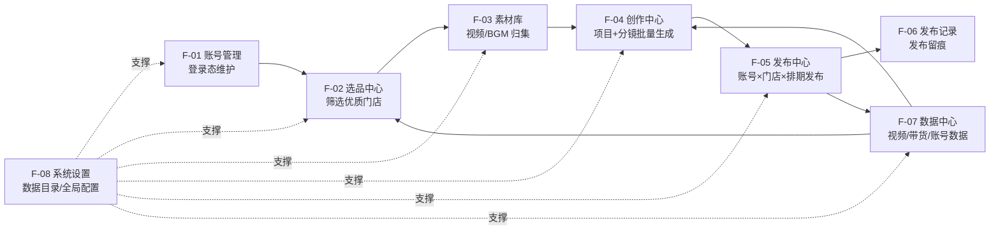
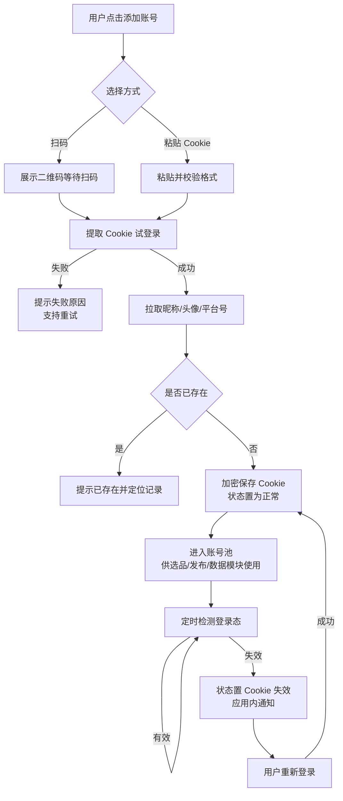
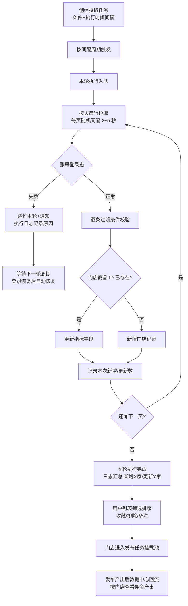
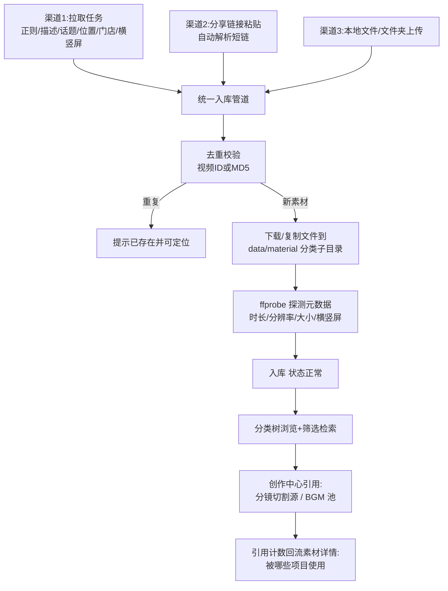
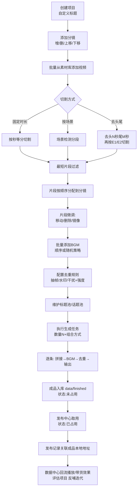
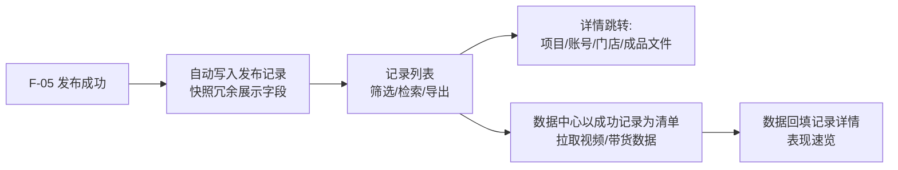
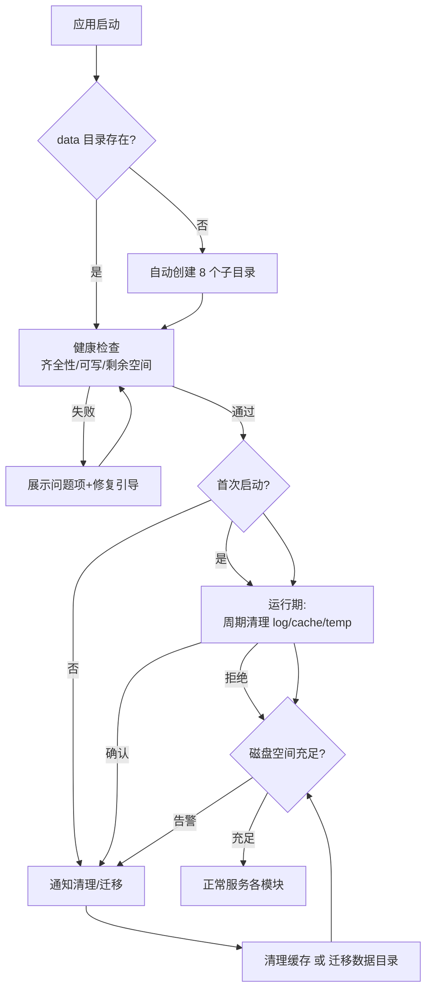
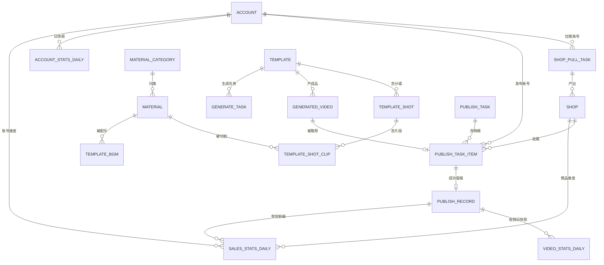

# 短视频工具需求文档（PRD）

| 文档属性 | 内容 |
| --- | --- |
| 文档名称 | 短视频工具需求文档 |
| 文档版本 | V1.0 |
| 文档状态 | 初稿（待评审） |
| 编写日期 | 2026-09-08 |
| 文档密级 | 内部 |

**版本修订记录**

| 版本 | 日期 | 修订人 | 修订说明 |
| --- | --- | --- | --- |
| V1.0 | 2026-09-08 | 产品经理 | 初稿创建，覆盖全部 7 大功能模块（#500 移除数据中心，原 F-07 已删除） |

---

## 目录

- 1. 引言
- 2. 产品概述
- 3. 系统总体设计
- 4. 功能需求详述
  - 4.1 F-01 账号管理
  - 4.2 F-02 选品中心
  - 4.3 F-03 素材库
  - 4.4 F-04 创作中心
  - 4.5 F-05 发布中心
  - 4.6 F-06 发布记录
  - 4.7 F-08 系统设置
- 5. 非功能需求
- 6. 数据模型汇总
- 7. 数据目录规范
- 8. 风险与合规
- 9. 界面与交互设计
- 10. 附录

---

# 1. 引言

## 1.1 文档目的

本文档完整定义"个人短视频平台管理工具"（以下简称"本工具"）的产品范围、功能需求、业务流程、数据模型与非功能性要求，作为产品设计、开发、测试与验收的统一依据。

## 1.2 文档范围

覆盖本工具 7 大功能模块：账号管理、选品中心、素材库、创作中心、发布中心、发布记录、系统设置。每个功能模块包含：功能描述、界面与字段定义、业务规则、闭环业务流程、数据模型、异常处理与验收标准。

> #500 数据中心模块（原 F-07）已移除，相关数据拉取/展示能力下线。

本文档不包含：详细 UI 视觉设计稿、接口协议明细、代码级实现方案。

## 1.3 读者对象

| 读者 | 关注重点 |
| --- | --- |
| 产品经理 | 功能完整性、业务闭环、验收标准 |
| 开发工程师 | 数据模型、业务规则、异常处理、技术约束 |
| 测试工程师 | 验收标准、边界条件、状态流转 |
| 运营使用者（工具实际用户） | 操作流程、字段口径 |

## 1.4 术语与缩写

| 术语 | 说明 |
| --- | --- |
| PRD | Product Requirements Document，产品需求文档 |
| API | Application Programming Interface，应用程序编程接口，系统间数据交互的约定接口 |
| Cookie | 浏览器登录凭证，用于维持视频平台登录态 |
| POI | Point of Interest，兴趣点，此处指视频平台上的门店/位置信息 |
| BGM | Background Music，背景音乐 |
| GMV | Gross Merchandise Volume，商品交易总额 |
| 分镜 | 视频项目中的组成单元，一个项目由多个按序排列的分镜构成，成品视频按分镜顺序拼接 |
| 去重 | 通过抽帧、水印、干扰等处理手段让批量生成的视频在平台内容识别中互不重复的处理过程 |
| 核销 | 用户购买团购券后到门店实际消费验证的动作 |
| 佣金率 | 每笔成交订单中平台分配给带货达人的收益比例 |
| 选品广场 | 视频平台精选联盟中可被达人选择推广的团购商品/门店集合 |
| FFmpeg | 开源音视频处理工具库，负责视频切割、拼接、镜像、水印等处理 |
| SQLite | 轻量级嵌入式关系型数据库，数据以单文件形式存储 |
| UUID | Universally Unique Identifier，通用唯一识别码，128 位随机标识符（本系统统一使用 32 位小写十六进制字符串），用于替代自增整型作为数据主键 |
| WAL | Write-Ahead Logging，SQLite 的一种日志模式，提升并发读写性能 |

---

# 2. 产品概述

## 2.1 产品背景

视频平台本地生活与团购带货场景中，个人运营者通常同时运营多个账号，面临以下痛点：

1. **多账号操作分散**：账号切换繁琐，登录态失效无法及时发现；
2. **选品靠人工浏览**：无法按佣金率、核销率等指标系统性筛选优质门店；
3. **素材管理混乱**：视频、音乐散落各处，缺少分类与检索能力；
4. **批量创作效率低**：二次剪辑（切割、拼接、镜像、加 BGM、去重）依赖人工逐条操作；
5. **发布无计划**：多账号发布时间、数量无节奏控制；
6. **数据不回流**：视频表现、带货收益无统一看板，无法反哺选品与创作决策。

本工具以"一站式个人视频平台运营工作台"定位，将 **账号 → 选品 → 素材 → 创作 → 发布 → 数据 → 决策反哺** 串成完整闭环。

## 2.2 产品定位

- **用户规模定位**：个人使用，单机运行，1 个操作用户；
- **部署形态**：本地桌面应用（数据全部落本地磁盘，不上云）；
- **核心价值**：批量化、自动化、数据化地管理"选—制—发—析"全流程。

## 2.3 用户画像

| 画像 | 描述 | 核心诉求 |
| --- | --- | --- |
| 个人团购带货达人 | 运营 3~20 个视频平台账号，主推本地门店团购 | 多账号管理、批量产出带门店挂载的视频、追踪佣金收益 |
| 个人短视频矩阵运营者 | 矩阵账号分发二次创作内容 | 素材批量处理、去重生成、定时定量发布 |

## 2.4 产品目标

| 目标 | 衡量指标 |
| --- | --- |
| 提升选品效率 | 按自定义条件一键拉取选品广场门店，替代人工浏览 |
| 提升创作效率 | 单项目一键批量生成差异化视频（≥10 条/分钟，取决于视频时长与硬件） |
| 提升发布效率 | 多账号定时定量自动发布，发布间隔可控 |
| 数据驱动决策 | 视频/带货/账号三类数据自动汇总，支持多维下钻 |

## 2.5 整体业务闭环（总览）



**主链路说明**：账号就绪 → 从选品中心圈定推广门店 → 素材库归集视频与音乐素材 → 创作中心按项目批量生成差异化成品 → 发布中心按账号/门店/数量/间隔排期发布 → 发布记录留痕。

---

# 3. 系统总体设计

## 3.1 技术形态（已选定）

> 选型参考 VideoMatrix 项目（已验证的成熟架构与打包链），在其基础上按本工具需求补强。

| 项 | 选定方案 | 说明 |
| --- | --- | --- |
| 应用形态 | **Python 3.12.10**（后端）+ Electron 28（桌面壳，React 18 + TypeScript + Vite + Zustand + Radix UI + Tailwind CSS） | 三层架构：渲染界面 → FastAPI 业务服务（HTTP）→ FFmpeg 视频处理（子进程） |
| 数据库 | SQLite（Python 内置 `sqlite3`，单文件 `data/db/short_video_tools.db`，开启 WAL） | UUID 主键由应用层生成；18 张表见第 6 章 |
| 视频处理 | FFmpeg / FFprobe（BtbN GPL 静态构建，PyInstaller 捆绑分发） | 切割、拼接、镜像、抽帧、水印、干扰、元数据探测；支持 NVENC GPU 编码 |
| 视频平台数据交互 | httpx + curl_cffi（TLS 指纹伪装）+ Cookie 加密存储（cryptography Fernet） | 视频平台 Web 端接口 + 账号 Cookie；统一限速队列防风控，详见第 8 章 |
| 任务调度 | APScheduler（定时任务：间隔/每日时刻/启停/next_run_time）+ 进程内任务队列 | 拉取/生成/发布/数据同步统一排队，单机低并发 |
| 扫码登录 | Electron BrowserWindow 内嵌视频平台二维码页 | F-01 添加账号 |
| Excel 导出 | openpyxl | 3.3-2 列表通用能力 |
| 内置字体 | 思源黑体（SIL OFL 1.1） | 动态水印文案烧录 |
| 打包分发 | PyInstaller（后端单 exe 捆绑 FFmpeg）+ electron-builder（NSIS 安装包） | 零依赖分发，用户免装 Python 与环境配置 |
| 日志 | 按天滚动文件日志（loguru 或 logging + TimedRotatingFileHandler） | 落 `data/log/` |

## 3.2 系统模块划分

| 模块编号 | 模块名 | 职责 | 依赖模块 |
| --- | --- | --- | --- |
| M1 | 账号模块 | 账号增删改查、登录态维护、状态检测 | 系统设置 |
| M2 | 选品模块 | 选品拉取任务、门店库管理 | 账号 |
| M3 | 素材模块 | 分类树、素材入库（拉取/分享链接/上传）、素材检索 | 系统设置 |
| M4 | 创作模块 | 项目/分镜管理、视频切割与批量生成、去重、标题话题池 | 素材 |
| M5 | 发布模块 | 发布任务、排期调度、发布执行 | 账号、选品、创作 |
| M6 | 记录模块 | 发布记录查询导出 | 发布 |
| M7 | 数据模块 | 视频/带货/账号数据拉取与看板、多维分析 | 发布记录 |
| M8 | 系统模块 | 数据目录管理、全局配置、缓存与临时文件清理 | 无 |

## 3.3 统一约定（全模块通用）

1. **任务模型（定时任务）**：拉取类任务（选品拉取、视频拉取）均为**定时任务**，创建时必须指定执行时间间隔（每 X 分钟 / 每 X 小时 / 每天固定时刻），不支持一次性立即执行；任务可随时启用/停用。每轮执行产生一条执行日志（结果：成功 / 部分成功 / 失败），执行中可暂停/取消；失败下一轮周期自动重跑（拉取入库按去重键幂等，不产生重复数据）。发布任务采用自身排期模型（开始时间 + 条目间隔），生成任务为本地手动触发，不适用周期模型。
2. **列表通用能力**：所有列表页支持条件筛选、多列排序、分页（默认 20 条/页，可选 20/50/100）、导出 Excel（API 说明：Excel 为微软办公表格文件格式）。
3. **删除通用规则**：单条删除需二次确认；被下游引用的数据（如被项目引用的素材、被发布记录引用的门店）默认"逻辑删除 + 关联校验提示"，避免脏数据。
4. **时间口径**：全系统统一使用本地时区；列表展示格式 `yyyy-MM-dd HH:mm:ss`。
5. **操作留痕**：所有新增/修改/删除/任务执行写入操作日志（落 `data/log/`，并在关键表保留 `create_time / update_time` 字段）。
6. **通知中心（全局）**：所有模块产生的应用内通知（登录态失效、任务失败/完成、风控拦截、磁盘告警等）统一进入**通知中心**：主界面右上角铃铛入口 + 未读数角标；通知列表按时间倒序，支持已读/全部已读/删除；重要通知（登录态失效、任务自动停用）同时弹 Toast（前端轻提示）一次；通知保留 30 天后自动清理。通知闭环：事件产生 → 入通知中心（未读）→ 用户查看（置已读）→ 执行对应动作（如重新登录）→ 相关通知自动标记"已处理"。

---

# 4. 功能需求详述

---

## 4.1 F-01 账号管理

### 4.1.1 功能概述

支持添加与管理多个视频平台账号，维护每个账号的登录态（Cookie），提供账号状态监控与健康提醒，为选品拉取、视频发布、数据拉取提供统一的账号身份基础。

**优先级**：P0（基础模块，其他模块的前置依赖）。

### 4.1.2 前置条件

- 系统设置中数据目录已初始化（见 F-08）；
- 用户持有可登录的视频平台账号（手机号 + 视频平台 App 用于扫码）。

### 4.1.3 功能清单

| 子功能编号 | 名称 | 描述 | 优先级 |
| --- | --- | --- | --- |
| F-01.1 | 添加账号 | 通过扫码或粘贴 Cookie 两种方式添加账号 | P0 |
| F-01.2 | 账号列表 | 查看账号基本信息与登录状态 | P0 |
| F-01.3 | 登录态检测 | 手动/定时检测 Cookie 有效性 | P0 |
| F-01.4 | 重新登录 | 登录态失效后重新扫码刷新 Cookie | P0 |
| F-01.5 | 编辑备注 | 修改账号备注名 | P1 |
| F-01.6 | 删除账号 | 删除账号及其关联凭证 | P0 |
| F-01.7 | 账号启停 | 暂停/恢复某账号参与自动发布与数据拉取 | P1 |

### 4.1.4 界面与字段说明

**账号列表字段**：

| 字段 | 说明 |
| --- | --- |
| 头像 / 昵称 | 从视频平台拉取的账号头像与昵称 |
| 平台号 | 账号唯一标识 |
| 备注名 | 用户自定义，默认取昵称；列表可编辑 |
| 状态 | 正常 / 未检测 / Cookie 失效 / 已停用 |
| 最近检测时间 | 上次登录态检测时间 |
| 粉丝数 | 账号登录时回填 |
| 作品数 | 账号登录时回填 |
| 创建时间 | 账号添加时间 |
| 操作 | 检测 / 重新登录 / 编辑备注 / 启停 / 删除 |

**添加账号弹窗**：方式单选「扫码登录」（弹出内嵌浏览器渲染视频平台二维码，扫码确认后自动提取 Cookie）或「粘贴 Cookie」（粘贴浏览器导出的 Cookie 文本，系统校验格式并试登录）。提交后系统立即拉取账号昵称、头像完成信息初始化。

### 4.1.5 业务规则

| 编号 | 规则 |
| --- | --- |
| F-01-R1 | 同一平台号不允许重复添加；重复添加时提示"账号已存在"并定位到已有记录 |
| F-01-R2 | Cookie 使用本机密钥加密后落库（密钥派生自机器特征 + 用户口令），列表页任何位置不展示 Cookie 明文 |
| F-01-R3 | 登录态定时检测默认每 6 小时一次（可在系统设置调整，范围 1~24 小时）；检测失败的账号状态置为「Cookie 失效」并在应用内通知提醒 |
| F-01-R4 | 「已停用」账号不参与发布任务执行与数据拉取，但不影响已有发布记录 |
| F-01-R5 | 删除账号需二次确认，并明确提示影响范围：该账号的待执行发布任务明细将被取消，历史发布记录与统计数据保留（账号字段显示"已删除账号"） |

### 4.1.6 闭环流程

**闭环链路**：添加账号 → 登录验证 → 纳入账号池 → 状态持续监控 → 失效告警 → 重新登录恢复 →（或）删除账号退出。



### 4.1.7 数据模型

**account 账号表**

| 字段 | 类型 | 必填 | 说明 |
| --- | --- | --- | --- |
| id | TEXT 主键，UUID 格式 | 是 | 账号内部 ID |
| douyin_id | TEXT | 是 | 平台号，唯一索引 |
| nickname | TEXT | 否 | 昵称 |
| avatar | TEXT | 否 | 头像本地存储路径（存 `data/material/` 下账号专用子目录，不随缓存清理删除） |
| remark | TEXT | 否 | 备注名 |
| cookie_encrypted | TEXT | 是 | 加密后的登录凭证 |
| status | TEXT | 是 | normal/undetected/invalid/disabled |
| last_check_time | DATETIME | 否 | 最近检测时间 |
| fan_count | INTEGER | 否 | 粉丝数（账号登录时回填） |
| work_count | INTEGER | 否 | 作品数（账号登录时回填） |
| create_time / update_time | DATETIME | 是 | 创建/更新时间 |
| deleted | INTEGER | 是 | 逻辑删除标记 0/1 |

### 4.1.8 异常与边界

| 场景 | 处理 |
| --- | --- |
| 扫码超时（默认 120 秒） | 二维码过期提示，点击刷新重新获取 |
| 粘贴 Cookie 格式非法 | 前端校验 + 后端试登录双重拦截，明确提示缺失的关键字段 |
| 试登录触发风控（验证码） | 提示用户改用扫码方式，或稍后重试 |
| Cookie 失效但账号正在执行发布任务 | 当前条目执行完毕后跳过该账号后续条目，明细标记失败原因"登录态失效"，并通知用户 |

### 4.1.9 验收标准

- [ ] 扫码添加账号成功后，列表出现该账号且状态为"正常"，昵称头像正确；
- [ ] 重复添加同一平台号被拦截并给出明确提示；
- [ ] 人工将某账号 Cookie 置为失效后，定时检测将其状态置为"Cookie 失效"且收到应用内通知；
- [ ] 重新登录后状态恢复"正常"，且能正常执行一次数据拉取验证；
- [ ] 删除账号后：列表不再显示；其历史发布记录仍可查看；其待执行发布明细被取消并留痕；
- [ ] 数据库中 Cookie 字段为密文存储。

---

## 4.2 F-02 选品中心

### 4.2.1 功能概述

参考视频平台精选联盟选品广场（主推**门店推广**类型商品），支持创建拉取任务按自定义条件批量拉取门店团购商品信息，形成本地门店库；提供门店列表的多维筛选与排序，为发布中心提供挂载门店来源。**闭环终点**：门店被发布任务引用，并可通过数据回看每个门店的带货产出。

**优先级**：P0。

### 4.2.2 前置条件

- 至少一个状态"正常"的账号（拉取接口需登录态）；
- 数据目录已初始化。

### 4.2.3 功能清单

| 子功能编号 | 名称 | 描述 | 优先级 |
| --- | --- | --- | --- |
| F-02.1 | 创建拉取任务 | 配置拉取条件与执行时间间隔（定时任务） | P0 |
| F-02.2 | 任务执行与监控 | 按间隔周期调度执行、执行日志与结果查看 | P0 |
| F-02.3 | 门店列表 | 多条件筛选、排序、分页、导出 | P0 |
| F-02.4 | 门店详情 | 单门店完整指标与拉取历史 | P1 |
| F-02.5 | 门店标记 | 收藏/排除/备注，辅助人工决策 | P1 |
| F-02.6 | 门店数据对比 | 勾选多家门店横向对比指标 | P2 |
| F-02.7 | 拉取任务管理 | 任务列表（状态/间隔/最近执行）、编辑条件与间隔、启用/停用、删除任务、查看执行日志 | P0 |

### 4.2.4 界面与字段说明

**4.2.4.1 创建拉取任务弹窗字段**

| 字段 | 控件 | 说明 |
| --- | --- | --- |
| 任务名称 | 文本框 | 必填，默认"选品任务_yyyyMMddHHmm" |
| 佣金率 | 区间（%） | 最低~最高，可留空表示不限 |
| 类目 | 多选树（美食/休闲玩乐/丽人/旅游/酒店等） | 不选表示全部；支持"仅含子类目"勾选 |
| 带货达人数 | 区间 | 最低~最高 |
| 带货销量 | 区间 | 最低~最高 |
| 核销率 | 区间（%） | 最低~最高 |
| 销售额 | 区间 | 最低~最高 |
| 拉取账号 | 账号下拉 | 使用哪个账号的登录态执行拉取，默认第一个正常账号 |
| 执行时间间隔 | 必选 | 每 X 分钟 / 每 X 小时 / 每天固定时刻（如每天 09:00），最小间隔 10 分钟 |

**4.2.4.2 门店列表字段**（用户指定口径）

| 字段 | 说明 |
| --- | --- |
| 类目 | 门店归属的团购类目（如"美食·火锅"） |
| 店名 | 门店/商品名称 |
| 佣金率 | 百分比展示，支持排序 |
| 带货达人数 | 近 30 天带该门店商品发视频的达人数量，支持排序 |
| 带货销量 | 团购券售出数量，支持排序 |
| 核销率 | 核销数/售出数，支持排序 |
| 销售额 | GMV，支持排序 |
| 内容浏览量 | 相关视频内容总浏览量 |
| 相关作品 | 带该门店的商品的相关视频作品数，点击可展开列表 |
| 人均 | 人均消费金额（销售额口径/销量口径，以广场页面展示为准） |
| 门店数量 | 该品牌/连锁下可挂载的门店总数 |
| 创建时间 | 门店记录首次入库时间 |
| 操作 | 详情 / 收藏 / 排除 / 备注 |

**筛选器**：上述所有字段均可作为列表筛选条件（与任务拉取条件相同的字段集合）；支持按"收藏/排除"状态过滤；支持仅看"被发布任务使用过"的门店。

### 4.2.5 业务规则

| 编号 | 规则 |
| --- | --- |
| F-02-R1 | 去重键为「门店商品 ID」：重复拉取时执行更新（指标字段取最新值，创建时间不变），不产生重复记录 |
| F-02-R2 | 每轮执行为分页串行拉取（直到无下一页或无符合条件结果），页间隔随机 2~5 秒防风控（间隔可在系统设置微调）；单轮中断不落断点，下一轮周期全量重拉，凭去重键（F-02-R1）幂等入库 |
| F-02-R3 | 拉取条件为"与服务端筛选条件交集"，客户端再做一次精确过滤兜底（服务端维度缺失时以本地过滤为准） |
| F-02-R4 | 「排除」状态的门店默认在列表隐藏（可切换显示），且不会出现在发布任务的门店候选中 |
| F-02-R5 | 每轮拉取涉及"新增或更新"的门店写入「任务-门店关联表」（任务 ID × 门店 ID × 本轮动作 × 时间），支持按任务筛选查看任意一轮拉取新增/更新的门店（门店主表仅记首次入库任务 ID，历史轮次靠关联表追溯） |
| F-02-R6 | 任务在指定账号登录态失效时跳过本轮执行（执行日志记录原因），登录恢复后下一轮自动恢复，任务不失效不丢弃 |
| F-02-R7 | 任务管理规则：**编辑**条件/间隔后从下一轮生效（当轮执行中不可编辑）；**停用**任务停止周期触发（已入队列的当轮执行完毕）；**删除**任务需二次确认，仅删任务及其执行日志，**已入库门店保留**（source_task_id 置空保留追溯文本）；执行日志保留 90 天自动清理 |

### 4.2.6 闭环流程

**闭环链路**：创建任务 → 条件拉取 → 去重入库 → 列表筛选决策（收藏/排除/备注）→ 门店进入发布任务挂载池 → 发布产出回流数据中心 → 门店维度收益可查（反哺下一次选品条件）。



### 4.2.7 数据模型

**shop_pull_task 选品拉取任务表**

| 字段 | 类型 | 必填 | 说明 |
| --- | --- | --- | --- |
| id | TEXT 主键，UUID 格式 | 是 | 任务 ID |
| task_name | TEXT | 是 | 任务名称 |
| conditions_json | TEXT | 是 | 拉取条件（JSON：佣金率/类目/达人/销量/核销率/销售额区间） |
| account_id | TEXT | 是 | 拉取账号 ID（UUID） |
| interval_config | TEXT | 是 | 执行时间间隔配置（JSON：类型 minute/hour/daily + 数值/时刻） |
| status | TEXT | 是 | 任务启停状态：enabled / disabled |
| last_run_time | DATETIME | 否 | 最近一轮执行时间 |
| next_run_time | DATETIME | 否 | 下次执行时间（调度器维护） |
| create_time / update_time | DATETIME | 是 | 创建/更新时间 |

**shop 门店表**

| 字段 | 类型 | 必填 | 说明 |
| --- | --- | --- | --- |
| id | TEXT 主键，UUID 格式 | 是 | 内部 ID |
| poi_id | TEXT | 是 | 视频平台门店/商品唯一 ID，唯一索引 |
| category | TEXT | 是 | 类目 |
| city | TEXT | 否 | 城市（拉取时解析门店归属城市，供标题占位符 `{城市}` 使用） |
| name | TEXT | 是 | 店名 |
| commission_rate | REAL | 是 | 佣金率（小数存储，如 0.12） |
| talent_count | INTEGER | 否 | 带货达人数 |
| sale_count | INTEGER | 否 | 带货销量 |
| verify_rate | REAL | 否 | 核销率（小数） |
| gmv | REAL | 否 | 销售额 |
| content_view_count | INTEGER | 否 | 内容浏览量 |
| related_work_count | INTEGER | 否 | 相关作品数 |
| per_capita | REAL | 否 | 人均消费 |
| shop_branch_count | INTEGER | 否 | 门店数量（连锁分支数） |
| mark | TEXT | 否 | favorite/excluded/none + 备注 remark 字段 |
| source_task_id | TEXT | 否 | 首次入库任务 ID（UUID） |
| create_time / update_time | DATETIME | 是 | 创建/更新时间 |
| deleted | INTEGER | 是 | 逻辑删除 |

**shop_pull_log 拉取执行日志表**：task_id、run_time、pages_done、new_count、update_count、fail_reason。

**shop_task_rel 任务-门店关联表**：task_id、shop_id、action（new/update）、run_time（所属执行轮次时间）；用于按任务/按轮次追溯门店产出。

### 4.2.8 异常与边界

| 场景 | 处理 |
| --- | --- |
| 拉取接口返回空（条件过严无结果） | 任务正常完成，汇总提示"本次拉取 0 条，建议放宽条件" |
| 接口限流/风控拦截 | 本轮立即中止并退避（指数退避 1min/2min/4min 后重试本轮），连续 3 轮执行失败自动停用任务并通知，避免加重风控 |
| 字段口径缺失（广场接口未返回某指标） | 该字段置空展示"-"，不影响入库 |
| 定时任务触发时应用未运行 | 错过的时间点不补跑（记录 miss 日志），从下一个时间点继续 |

### 4.2.9 验收标准

- [ ] 配置佣金率 ≥10% 且类目=美食的任务触发一轮执行后，列表新增门店的佣金率与类目均满足条件；
- [ ] 同一门店被二次拉取后不产生重复记录，指标更新为最新值，创建时间不变；
- [ ] 任务执行中点"暂停"中止本轮，下一轮周期触发后重新执行且凭去重键不重复入库；停用任务后周期不再触发；
- [ ] 拉取过程中手动使账号 Cookie 失效：本轮跳过并收到通知（执行日志记录原因），重新登录后下一轮周期自动恢复执行；
- [ ] 列表全部指定字段（类目/店名/佣金率/带货达人数/带货销量/核销率/销售额/内容浏览量/相关作品/人均/门店数量/创建时间）展示齐全且数值字段可排序；
- [ ] "排除"门店默认隐藏且不出现在发布任务候选中；
- [ ] 门店列表可按任务筛选，查看该任务新增与更新的门店数量。

---

## 4.3 F-03 素材库

### 4.3.1 功能概述

统一管理视频与背景音乐（BGM）两类素材。支持自定义树形分类、三种入库渠道（拉取任务、分享链接导入、本地文件/文件夹上传）、素材检索与预览，为创作中心提供素材来源。**闭环终点**：素材被切割/引用进入项目分镜与 BGM 池，使用情况（被引用次数）可追溯。

**优先级**：P0。

### 4.3.2 前置条件

- 数据目录已初始化，`data/material/` 可写；
- 拉取渠道需正常登录态账号；上传渠道无登录要求。

### 4.3.3 功能清单

| 子功能编号 | 名称 | 描述 | 优先级 |
| --- | --- | --- | --- |
| F-03.1 | 分类管理 | 树形分类的增删改、拖拽排序与层级调整 | P0 |
| F-03.2 | 创建视频拉取任务 | 按自定义条件拉取视频平台视频入库 | P0 |
| F-03.3 | 分享链接导入 | 粘贴分享链接/口令自动解析入库 | P0 |
| F-03.4 | 文件/文件夹上传 | 本地视频、音乐文件批量入库，自动归类 | P0 |
| F-03.5 | 素材列表与检索 | 多条件筛选、预览、详情 | P0 |
| F-03.6 | 素材维护 | 重命名、移动分类、删除、重复检测 | P1 |
| F-03.7 | 视频拉取任务管理 | 任务列表、编辑条件与间隔、启用/停用、删除任务、查看执行日志（规则同 F-02-R7，删除任务保留已入库素材） | P0 |

### 4.3.4 界面与字段说明

**4.3.4.1 分类树（左侧栏）**

- 树形结构，层级上限 4 级；节点上展示该节点（含子孙）素材数；
- 节点操作：新增子分类、重命名、删除（需先清空或迁移其下素材）、拖拽调整父子关系与排序；
- 内置两个根节点：「视频」「音乐」（类型根节点，不可删除、不可改类型），自定义分类挂在对应根下；
- 分类数据按类型隔离：视频分类树与音乐分类树相互独立。

**4.3.4.2 创建视频拉取任务弹窗字段**

| 字段 | 控件 | 说明 |
| --- | --- | --- |
| 任务名称 | 文本框 | 必填，默认"素材任务_yyyyMMddHHmm" |
| 标题正则 | 文本框 | 正则表达式（RegExp，用于文本模式匹配的表达式语法）匹配视频标题，如 `^探店.*火锅` |
| 作品描述关键词 | 文本框 | 多个关键词逗号分隔，命中任一即保留（可切换"全部命中"） |
| 话题 | 文本框 | 话题标签，如 `#火锅探店`，多个逗号分隔 |
| 位置 | 文本框 | POI 位置名称关键词，如"朝阳区" |
| 门店 | 文本框 | 门店名称关键词，或从本地门店库选择 |
| 画面方向 | 单选 | 全部 / 竖屏（9:16）/ 横屏（16:9） |
| 发布时间范围 | 日期区间 | 可留空不限 |
| 入库分类 | 分类树选择 | 必选：拉取到的视频落入该分类（仅可选「视频」类型根下的分类） |
| 拉取账号 / 执行时间间隔 | 同选品任务 | 定时任务，按间隔周期执行 |

**4.3.4.3 分享链接导入弹窗**

- 多行文本域：支持一次粘贴多条分享文本（分享口令样式如 `7.92 xxx:/ 复制打开视频平台...`，或 `v.douyin.com` 短链）；
- 导入目标分类：选择分类树节点；
- 提交后逐条解析：提取短链 → 请求解析取视频 ID → 拉取详情（标题、时长、分辨率、发布者）→ 下载无水印视频 → 元数据入库。

**4.3.4.4 素材列表字段**（用户指定口径）

| 字段 | 说明 |
| --- | --- |
| 标题 | 素材标题（缩略图列首列：视频显示首帧封面） |
| 类型 | 视频 / 音乐 |
| 分类 | 所属分类树路径（如"视频/探店/火锅"） |
| 时长 | 时长（分:秒），支持排序 |
| 大小 | 文件大小（MB），支持排序 |
| 来源 | 拉取任务 / 分享链接 / 本地上传 |
| 分辨率 | 宽×高（视频）；音乐显示"-" |
| 创建时间 | 入库时间 |
| 操作 | 预览 / 编辑（标题、分类）/ 删除 |

**筛选器**：类型、分类（含子孙）、来源、时长区间、大小区间、分辨率、标题关键词、创建时间区间。

### 4.3.5 业务规则

| 编号 | 规则 |
| --- | --- |
| F-03-R1 | 素材去重键为「来源视频 ID」（拉取/分享渠道）；上传渠道按「文件内容 MD5」（消息摘要算法，用于判断文件内容是否相同）去重；重复时提示已存在并定位原素材（可选择仍导入为新记录，文件引用同一份） |
| F-03-R2 | 入库即调用 ffprobe 探测元数据：时长、分辨率、大小、编码格式，竖屏/横屏自动判定（宽高比 >1 为横屏）；探测失败记警告但仍允许入库，元数据置空 |
| F-03-R3 | 素材文件统一存 `data/material/`，子目录按 `类型/分类路径/年月` 组织；文件名规则 `{素材ID}_{净化后标题}.{原扩展名}`（净化：去特殊字符，限 50 字符） |
| F-03-R4 | 删除素材：被项目分镜或 BGM 池引用时二次确认并提示引用位置；确认删除后引用处置换为"素材缺失"占位，不自动删除项目 |
| F-03-R5 | 分享链接解析失败的条目在结果反馈中逐条列出失败原因（链接失效/风控/格式非法），成功条目正常入库 |
| F-03-R6 | 上传文件夹时递归扫描，仅接受白名单扩展名：视频 `mp4/mov/mkv/avi/webm`，音乐 `mp3/wav/aac/flac/m4a`；其余跳过并汇总提示 |
| F-03-R7 | 拉取任务下载与选品任务共用全局请求队列与限速策略，不并发打满请求 |
| F-03-R8 | **素材缺失闭环**：引用素材文件时校验存在性，缺失则该素材状态置「素材缺失」并在列表标红提示；提供「重新定位文件」入口（选择新路径后更新 file_path 并恢复状态）；缺失素材不参与切割与 BGM 取用 |

### 4.3.6 闭环流程

**主闭环（入库 → 管理 → 使用 → 追溯）**：



**分享链接导入子流程（闭环）**：粘贴多条分享文本 → 提交 → 逐条解析（提取短链 → 重定向取视频 ID → 拉详情 → 下载）→ 每条结果实时反馈（成功/失败原因）→ 全部处理完弹窗汇总「成功 X 条 / 失败 Y 条」→ 成功素材自动落入所选分类 → 可一键跳转列表查看。

**上传子流程（闭环）**：选择文件或文件夹 → 类型白名单过滤 → 逐个复制入 `data/material`（移动而非复制可选）→ MD5 去重 → ffprobe 探测 → 入库 → 汇总「导入 X 个 / 跳过 Y 个（重复或不支持格式）」。

### 4.3.7 数据模型

**material_category 素材分类表**

| 字段 | 类型 | 必填 | 说明 |
| --- | --- | --- | --- |
| id | TEXT 主键，UUID 格式 | 是 | 分类 ID |
| parent_id | TEXT | 是 | 父分类 ID（UUID），根节点为空字符串 |
| name | TEXT | 是 | 分类名 |
| type | TEXT | 是 | video / music（挂靠的类型根） |
| sort_order | INTEGER | 是 | 同级排序 |
| create_time / update_time | DATETIME | 是 | 创建/更新时间 |
| deleted | INTEGER | 是 | 逻辑删除 |

**material 素材表**

| 字段 | 类型 | 必填 | 说明 |
| --- | --- | --- | --- |
| id | TEXT 主键，UUID 格式 | 是 | 素材 ID |
| title | TEXT | 是 | 标题 |
| type | TEXT | 是 | video / music |
| category_id | TEXT | 是 | 所属分类 ID（UUID） |
| duration_ms | INTEGER | 否 | 时长（毫秒） |
| file_size | REAL | 是 | 大小（字节） |
| source_type | TEXT | 是 | pull / share / upload |
| source_ref | TEXT | 否 | 来源视频 ID（拉取/分享） |
| file_md5 | TEXT | 是 | 内容指纹 |
| resolution | TEXT | 否 | 宽x高 |
| orientation | TEXT | 否 | vertical / horizontal |
| file_path | TEXT | 是 | 相对 data 目录的存储路径 |
| file_status | TEXT | 是 | normal / missing（文件缺失，见 F-03-R8） |
| cover_path | TEXT | 否 | 封面图路径 |
| raw_link | TEXT | 否 | 原始分享链接 |
| ref_count | INTEGER | 是 | 被项目引用次数（冗余计数） |
| create_time / update_time | DATETIME | 是 | 创建/更新时间 |
| deleted | INTEGER | 是 | 逻辑删除 |

**video_pull_task 视频拉取任务表**：结构同 shop_pull_task，conditions_json 换为素材条件（正则/关键词/话题/位置/门店/横竖屏/时间范围）；**video_pull_log** 同理记录每次执行新增/跳过数。

### 4.3.8 异常与边界

| 场景 | 处理 |
| --- | --- |
| 无水印地址下载失败 | 降级尝试备用源；仍失败则该条标记失败并保留详情（不含文件），支持单独重试下载 |
| 分享文本中不含任何链接 | 提交时前端校验拦截，提示格式要求 |
| 上传超大文件（>2GB） | 允许，入库走异步复制并显示进度，不阻塞界面 |
| 分类被删除时其下仍有素材 | 提示先将素材迁移到其他分类，或选择"素材移入父分类"选项 |
| 正则表达式语法错误 | 保存任务时即时校验并提示错误位置 |

### 4.3.9 验收标准

- [ ] 分类树支持 4 级层级的新增/重命名/删除/拖拽，素材计数实时正确；
- [ ] 视频拉取任务按"标题正则 + 竖屏"执行后，入库视频标题全部匹配正则且全部为竖屏；
- [ ] 粘贴 3 条分享文本导入：2 条成功入库（标题/时长/分辨率正确、可播放），1 条失效链接给出明确失败原因，汇总弹窗数字正确；
- [ ] 拖入含 mp4/mp3/txt 的文件夹：仅 mp4/mp3 入库，txt 跳过并在汇总中体现；
- [ ] 同一文件二次上传触发 MD5 去重提示并可定位原素材；
- [ ] 列表字段（标题/类型/分类/时长/大小/来源/分辨率/创建时间）齐全，筛选与排序生效；
- [ ] 删除被项目引用的素材时出现引用提示，删除后项目中对应项显示"素材缺失"而非静默丢失。

---

## 4.4 F-04 创作中心

### 4.4.1 功能概述

以「项目 + 分镜」组织视频批量创作：一个项目由多个有序分镜构成，每个分镜挂载多个候选视频片段；系统按分镜顺序拼接片段、叠加 BGM 与去重处理，批量生成差异化成品视频到 `data/finished/`，供发布中心调用。支持标题/话题池配置，发布时随机选用。

**优先级**：P0（本工具核心竞争力模块）。

### 4.4.2 前置条件

- 素材库中已有可用视频/BGM 素材；
- 本机 FFmpeg 可用（系统设置中可配置 FFmpeg 路径）。

### 4.4.3 功能清单

| 子功能编号 | 名称 | 描述 | 优先级 |
| --- | --- | --- | --- |
| F-04.1 | 项目列表 | 项目总览与入口 | P0 |
| F-04.2 | 创建项目 | 自定义标题新建项目 | P0 |
| F-04.3 | 分镜管理 | 增加/删除/上移/下移分镜 | P0 |
| F-04.4 | 分镜视频管理 | 分镜内视频的移动/删除/镜像 | P0 |
| F-04.5 | 批量添加视频+切割 | 按固定时长/按场景/去头尾后切割，顺序分配到分镜 | P0 |
| F-04.6 | 批量添加 BGM | 按顺序或随机使用背景音乐 | P0 |
| F-04.7 | 去重规则配置 | 自动抽帧/动态水印/动态干扰 | P0 |
| F-04.8 | 标题/话题池 | 维护标题与话题列表，发布时随机选用 | P1 |
| F-04.9 | 批量生成 | 执行项目生成任务，产出成品视频 | P0 |
| F-04.10 | 成品视频管理 | 独立成品列表：预览/播放、查看占用状态与关联发布记录、删除未占用成品、定位文件；支持按项目/状态筛选 | P0 |

### 4.4.4 界面与字段说明

**4.4.4.1 项目列表字段**（用户指定口径）

| 字段 | 说明 |
| --- | --- |
| 标题 | 项目标题 |
| 分镜数 | 分镜数量，支持排序 |
| 能生成视频的总数 | 理论组合数 = 各分镜候选片段数的乘积（组合规则见 F-04-R10；组合数超过上限 100000 时显示">100000"），支持排序 |
| 已生成视频数量 | 实际已生成的成品数 / 其中已被发布占用的数量（悬停展示），支持排序 |
| 创建时间 | 支持排序 |
| 操作 | 编辑 / 生成 / 复制项目 / 删除 |

**4.4.4.2 项目编辑页（三栏布局）**

- **左栏：分镜列表**（纵向卡片流）
  - 卡片头：分镜序号 + 分镜名（默认"分镜N"，可改）+ 操作按钮【上移】【下移】【删除】【添加视频】；
  - 卡片体：该分镜的视频片段网格，每个片段显示封面、时长、来源素材名，片段操作：【移动到其他分镜】【删除】【镜像】（镜像 = 画面水平翻转，用于去重素材池扩充）；
  - 底部按钮：【+ 添加分镜】。
- **右栏上部：BGM 池**：已添加音乐列表（序号/名称/时长/使用策略标记），【批量添加 BGM】按钮，策略单选「顺序使用 / 随机使用」。
- **右栏下部：去重规则与生成配置**：
  - 去重规则开关组（可多选，强度滑杆 低/中/高）：自动抽帧、动态水印（可配水印文案或图片）、动态干扰；
  - 生成数量：本次生成条数（默认 10，上限 = 组合总数）；
  - 组合方式：随机组合 / 顺序组合（顺序组合保证不重复遍历）；
  - 输出分辨率：跟随素材 / 指定 1080x1920；
  - 标题池 / 话题池入口（见 4.4.4.3）。

**4.4.4.3 标题池 / 话题池弹窗**

- 两个 Tab：标题池、话题池；
- 每行一条，支持批量粘贴（每行一条）导入；
- 标题支持变量占位符：`{门店名}` `{城市}` `{类目}`（发布时用实际门店信息替换）；
- 话题行格式 `#话题1 #话题2`；
- 池分两层：全局池（系统级，所有项目共用）+ 项目池（仅本项目），发布时先项目池后全局池，两层合并后随机。

**4.4.4.4 批量添加视频弹窗（从素材库选择）**

| 配置项 | 说明 |
| --- | --- |
| 素材选择 | 弹出素材选择器（支持按分类树/关键词筛选，多选） |
| 切割方式 | 单选：① 不切割，整条使用；② 按固定时长切割（输入秒数）；③ 按场景切割（FFmpeg 场景检测，自动分段）；④ 去头尾后切割（先去头部 N 秒 + 尾部 M 秒，再按①/②/③处理） |
| 最短片段过滤 | 丢弃小于 X 秒的片段（默认 3 秒），避免碎片段 |
| 分配方式 | 切割后片段按顺序循环分配到「当前分镜」或「指定多个分镜」（从第 K 个分镜开始顺序填入，填满最后一个分镜后回到第一个继续） |

### 4.4.5 业务规则

| 编号 | 规则 |
| --- | --- |
| F-04-R1 | 单个分镜候选片段上限 200；组合总数上限保护 100000（超出时提示收窄素材） |
| F-04-R2 | 分镜上移/下移交换相邻分镜顺序（首分镜禁用上移，末分镜禁用下移）；顺序变化即时持久化 |
| F-04-R3 | 片段移动到其他分镜：弹出分镜选择器，确认后移动；镜像操作生成新片段记录（引用同一源文件 + 镜像标记），原片段保留 |
| F-04-R4 | 同一成品组合（各分镜片段的组合键）不允许重复生成：接受-拒绝采样 + 数据库唯一索引硬约束兜底；连续失败超阈值自动停止 |
| F-04-R5 | 生成时逐条处理：拼接片段 → 叠加 BGM（音量自动压低至原声 30%，可配）→ 依序应用去重规则 → 输出 `data/finished/{项目ID}/{生成序号}_{时间戳}.mp4`；生成任务入全局队列，可暂停/取消/重试 |
| F-04-R6 | 去重规则细节：**自动抽帧**=随机丢弃/复制少量帧造成帧数微扰；**动态水印**=文案/图片以随机位置、随机透明度（10%~30%）叠加；**动态干扰**=随机组合轻微缩放（98%~102%）、亮度微调（±5%）、裁边（1%~3%）后回原尺寸。强度档位控制各参数扰动幅度 |
| F-04-R7 | BGM 顺序使用 = 按池内序号轮流（第 i 条成品用第 i mod n 首）；随机使用 = 每条成品等概率随机选曲；BGM 短于视频时循环拼接，长于视频时截断 |
| F-04-R8 | 删除项目需二次确认；已被发布任务引用未发布的成品视频需选择处置（保留文件仅删项目记录 / 一并删除） |
| F-04-R9 | 成品视频生成后状态为「未占用」；被发布任务取用后置「已占用」，同一成品不允许发布到多个账号（保证内容唯一性） |
| F-04-R10 | **组合规则（结构定义）**：一个成品视频 = 从 N 个分镜中**按分镜顺序各取恰好 1 个候选片段**依序拼接（分镜 1 片段 → 分镜 2 片段 → … → 分镜 N 片段）；不允许跳过任何分镜，不允许同一分镜取多个片段。理论组合总数由倒推公式 `_uniform_count(n, c)` 计算（见 `docs/视频组合算法约束.md`），受 `MAX_COMBINATIONS=100000` 上限保护 |
| F-04-R11 | **组合唯一性（防重复）**：每个成品记录唯一组合键 = 按分镜顺序拼接的片段 ID 序列（数据库唯一索引硬约束）。生成任务按接受-拒绝采样 + 4 项约束（同源率 ≤ 50% / 位置重叠 ≤ 50% / 权重采样 / 同权重随机）挑选组合；满足 4 项约束的合法组合写入 `generated_video.combination_key`，数据库层硬约束兜底。**同一组合原则上仅生成一次**；素材池耗尽（连续失败超 `count × 20 + 100` 阈值）时停止生成并提示扩充素材 |
| F-04-R12 | **视频平台内容规范校验（生成前硬校验，不通过则拒绝生成该条）**：① 成片总时长 5 秒 ~ 15 分钟（低于 5 秒无法发布）；② 分辨率与宽高比符合平台规格（竖屏 9:16 推荐 1080×1920，横屏 16:9 推荐 1920×1080，混用横竖屏素材时统一转换到输出目标比例，黑边/裁切由去重规则处理）；③ 码率与封装：H.264 编码 + AAC 音频 + MP4 容器，码率符合平台推荐区间；④ 音频轨存在且时长与视频对齐（BGM 按 R7 处理） |
| F-04-R13 | **同源片段防重复违规**：同一个源素材（或其镜像副本）在同一成品中**最多出现 1 次**（不同分镜不得引用同源片段，含互为镜像的片段，判定键 = 源素材 ID）；同一账号的历史发布中，同一组合键不得重复出现（发布中心取用时校验） |
| F-04-R14 | **组合多样性建议（软约束，可配置）**：相邻分镜的片段不宜来自同一源素材（避免画面跳变重复感）；单账号同日发布中，任意两条成品的组合相似度（相同片段数/总分镜数）超过阈值（默认 50%）时发布中心给出预警提示，可忽略强行发布 |
| F-04-R15 | 成品管理规则：仅「未占用」成品可删除（已占用需先取消对应发布明细或删除发布记录关联）；删除成品需二次确认，可选「同时删除文件 / 仅删记录保留文件」；删除后对应组合键释放，可重新生成同组合成品 |

### 4.4.6 闭环流程

**主闭环**：创建项目 → 配分镜 → 批量导入素材并切割分配 → 配 BGM/去重/标题话题池 → 执行生成任务 → 成品入 `data/finished/`（未占用）→ 发布中心取用（置已占用）→ 发布记录可回看成品本地地址 →（可选）数据回流后评估项目优劣，复制项目迭代。



**生成任务子流程（闭环）**：点击生成 → 校验（组合数>0、素材文件存在、BGM 可选、FFmpeg 可用）→ 入队执行 → 每条完成更新进度（已生成/总数）→ 失败条目记录原因可单独重试 → 完成后弹窗汇总「成功 X / 失败 Y」+「在文件夹中查看」入口。

### 4.4.7 数据模型

**project 项目表**：id、title、shot_count（冗余）、bgm_strategy（order/random）、dedup_rules_json（抽帧/水印/干扰开关与强度）、output_resolution、cursor（顺序组合游标）、status、create_time、update_time、deleted。

**project_shot 分镜表**

| 字段 | 类型 | 必填 | 说明 |
| --- | --- | --- | --- |
| id | TEXT 主键，UUID 格式 | 是 | 分镜 ID |
| project_id | TEXT | 是 | 所属项目 ID（UUID） |
| name | TEXT | 是 | 分镜名，默认"分镜N" |
| sort_order | INTEGER | 是 | 顺序（0 起） |
| create_time / update_time | DATETIME | 是 | 创建/更新时间 |

**project_shot_clip 分镜片段表**

| 字段 | 类型 | 必填 | 说明 |
| --- | --- | --- | --- |
| id | TEXT 主键，UUID 格式 | 是 | 片段 ID |
| shot_id | TEXT | 是 | 所属分镜 ID（UUID） |
| material_id | TEXT | 是 | 来源素材 ID（UUID） |
| clip_start_ms / clip_end_ms | INTEGER | 是 | 片段在源素材中的起止毫秒；整条使用时为 0/时长 |
| mirrored | INTEGER | 是 | 是否镜像 0/1 |
| create_time | DATETIME | 是 | 创建时间 |

**project_bgm 项目 BGM 表**：project_id、material_id、sort_order。

**text_pool 文案池表**：id、pool_type（title/topic）、scope（global/project）、project_id（scope=project 时）、content、enabled、create_time、update_time。

**generated_video 成品视频表**：id、project_id、combination_key（各分镜片段 ID 有序拼接，唯一索引防重复；同源衍生品此键相同需加派生序号后缀区分）、derivative_of（同源衍生标记：派生自哪个成品 ID，普通成品为空）、file_path、file_size、duration_ms、bgm_material_id、dedup_params_json、status（idle/occupied）、publish_record_id（占用它的发布记录）、create_time。

**generate_task 生成任务表**：id、project_id、plan_count、done_count、fail_count、status、fail_detail_json、create_time、update_time。

### 4.4.8 异常与边界

| 场景 | 处理 |
| --- | --- |
| 分镜无候选片段即点生成 | 拦截提示"分镜X无素材"，标红定位 |
| 源素材文件被外部删除 | 生成前校验文件存在性，缺失项列出并跳过该组合，任务继续 |
| FFmpeg 进程崩溃/超时 | 该条成品标记失败（原因：处理异常），任务继续下一条；连续失败 5 次自动暂停任务并通知 |
| 磁盘空间不足（生成前预估所需空间） | 预检失败则任务不入队，提示清理 data/temp 或更换数据目录 |
| 组合总数为 1 但要求生成多条 | 提示去重规则可产生差异，允许继续（同组合+不同去重参数生成），但强提示内容重复风险 |

### 4.4.9 验收标准

- [ ] 项目列表字段（标题/分镜数/片段数/可生成数/已生成数/创建时间）正确：片段数 = 全部分镜的片段合计；可生成数 = 按倒推规则算出的合法组合上界（存在空分镜则为 0）；
- [ ] 分镜增删与上下移即时生效并持久化（刷新后顺序不变）；分镜数量达到 50 后「添加分镜」置灰拒绝；
- [ ] 选中 3 条素材按"去头 2 秒尾 1 秒 + 固定 5 秒切割"：产出片段数 = floor((各素材有效时长)/5)，碎片 <3 秒被过滤，片段按顺序落入指定分镜；
- [ ] 片段可移动到其他分镜、可删除、镜像后生成的新片段在成品中画面水平翻转；
- [ ] 添加 2 首 BGM 随机策略生成 4 条成品：每条成品均含 BGM，且 4 条中两首均被用到（统计意义）；
- [ ] 开启全部去重规则生成 5 条同组合成品：任意两条对比，抽帧帧数、水印位置/透明度、干扰参数均不同（查看 dedup_params_json 抽查）；
- [ ] 成品落 `data/finished/{项目ID}/` 且状态"未占用"；被发布任务取用后变"已占用"，再次取用被拒绝；
- [ ] 组合规则校验：任意一条成品均可分解为「每个分镜恰好 1 个片段、按分镜序拼接」；同源片段（含互为镜像）在同一成品中不重复出现；
- [ ] 同一组合键二次生成被数据库唯一索引拒绝；素材池耗尽时生成任务停止并提示扩充素材；
- [ ] 规范校验：构造总时长 3 秒的组合被拒绝生成并提示；混用横竖屏素材的成品输出为目标比例无拉伸变形；
- [ ] 生成任务中途暂停/取消生效，重试仅补做失败与未做条目；
- [ ] 标题池维护后，预览随机结果在池内且变量占位符可被门店信息替换。

---

## 4.5 F-05 发布中心

### 4.5.1 功能概述

创建发布任务，将「项目成品视频 × 账号 × 门店」按规则排期：每个账号发布指定数量的视频，条与条之间保持设定时间间隔；发布时随机选用标题池/话题池文案，挂载指定门店；执行结果写入发布记录。

**优先级**：P0。

### 4.5.2 前置条件

- 至少一个"正常"状态账号；
- 至少一个项目存在"未占用"成品视频，且数量满足任务需求；
- 发布门店已从选品中心圈定（收藏或未排除状态）。

### 4.5.3 功能清单

| 子功能编号 | 名称 | 描述 | 优先级 |
| --- | --- | --- | --- |
| F-05.1 | 创建发布任务 | 配置发布规则并生成排期 | P0 |
| F-05.2 | 任务列表与排期预览 | 查看任务与每条发布明细的时间计划 | P0 |
| F-05.3 | 任务调度执行 | 定时触发、逐条发布、失败重试 | P0 |
| F-05.4 | 任务控制 | 暂停/恢复/取消任务 | P0 |
| F-05.5 | 发布任务管理 | 任务列表（状态/进度汇总）、删除已终态任务、重新复制任务参数为新任务草稿；未启动（草稿态）任务可编辑全部规则 | P1 |

### 4.5.4 界面与字段说明

**创建发布任务弹窗字段**（用户指定规则全集）：

| 字段 | 控件 | 说明 |
| --- | --- | --- |
| 任务名称 | 文本框 | 必填，默认"发布任务_yyyyMMddHHmm" |
| 视频项目列表 | 多选 | 務选至少 1 个项目；展示各项目可用水量（未占用成品数），按所选顺序依次取用 |
| 账号列表 | 多选 | 至少 1 个"正常"账号，仅展示可选账号 |
| 门店列表 | 多选 | 从选品中心门店库选择（默认过滤已排除门店，可切换显示）；至少 1 家 |
| 每账号发布数量 | 数字 | 每个账号本任务发布条数（1~50） |
| 发布开始时间 | 日期时间 | 排期起点，默认当前时间 +10 分钟 |
| 发布时间间隔 | 数字+单位 | 同账号两条发布之间的间隔（分钟/小时，最小 5 分钟，防风控下限提醒） |
| 账号间并发策略 | 单选 | 串行（逐账号逐条）/ 按账号并行（每账号内部仍按间隔串行）；默认串行 |
| 标题/话题取用 | 单选 | 随机选用（项目池+全局池合并去重后随机） |
| 挂载门店分配 | 单选 | 随机 / 轮流（账号第 i 条挂载列表第 i mod n 家门店） |

**任务详情页**：

- 任务信息区：状态、开始时间、进度（已发布/总数）；
- 发布明细表（排期预览）：序号、计划时间、账号、项目、成品视频文件名、门店、状态（待发布/发布中/成功/失败/已取消）、失败原因、操作（单条重试/跳过）。

### 4.5.5 业务规则

| 编号 | 规则 |
| --- | --- |
| F-05-R1 | 创建时按 `schedule_mode`（`fixed` 固定间隔 / `balanced` 均衡间隔）调用 `publish_schedule.build_schedule()` 生成完整排期；预校验可用水量：Σ(各账号发布数量) ≤ Σ(所选项目未占用成品数)，不足时明确提示缺口条数；时间窗超出排期容量抛 `ScheduleTimeShortageError(category='time')` |
| F-05-R2 | 成品视频分配：按项目选择顺序从各项目"未占用"成品中取用并即时置"已占用"，同一成品绝不分给两条明细（任务取消/明细失败释放占用） |
| F-05-R3 | 每条发布执行动作：取成品 → 随机标题（替换变量占位符）→ 随机话题 → 上传视频 → 挂载门店 → 提交发布 → 校验发布成功（回查作品存在）→ 写发布记录 |
| F-05-R4 | 发布失败重试：网络/风控类失败自动重试最多 3 次（退避 1min/3min/5min）；仍失败标记失败并继续下一条（不影响排期其余条目）；内容违规类失败不重试，直接标记并通知 |
| F-05-R5 | 到达计划时间但任务处于暂停：该条目顺延至恢复后尽快执行，并记录"因暂停顺延" |
| F-05-R6 | 发布执行前二次校验账号登录态：失效则该账号全部待执行明细置「挂起（suspended）」+ 通知；账号重新登录恢复"正常"后，挂起明细自动恢复「待发布」并按原计划时间与当前时间较大者尽快补执行 |
| F-05-R7 | 任务完成条件：全部明细到达终态（成功/失败/已取消）；完成后发送应用内通知汇总 |
| F-05-R8 | **取用成品时执行组合防重校验（承接 F-04-R13）**：候选成品与该账号历史发布记录的组合键比对，重复则换下一个候选；候选成品与该账号同日已排期/已发布成品的组合相似度超阈值（F-04-R14）时给出预警提示，用户确认后可强行使用 |
| F-05-R9 | **同源衍生限制**：同一账号的发布明细不得取用「同源衍生」于该账号已发布成品的视频（承接 F-04-R11），取用时校验 derivative_of 链路 |
| F-05-R10 | 发布任务管理规则：仅「草稿态」可编辑规则；运行中任务不可编辑（可暂停/取消）；删除任务仅限已终态（完成/已取消），删除需二次确认且**发布记录永久保留**；「复制为新任务」携带原任务全部参数生成草稿，用户调整后另行创建 |
| F-05-R11 | **排期异常层**：异常基类 `ScheduleOverflowError(ValueError)`，通过 `category` 字段区分（`time` 时间窗不足 / `video` 视频目录视频数不足）；子类 `ScheduleTimeShortageError(category='time')` / `ScheduleVideoShortageError(category='video')`；前端按 `category` 回退到对应 step 提示用户 |
| F-05-R12 | **视频目录模式**：扫描指定目录下合规视频 → 自动均分到账号 → 入库时按目录顺序排视频文件绝对路径，避免重复使用；视频数 < 需发布数 → `ScheduleVideoShortageError`（API 层即拒绝，UI 直接弹出提示） |

### 4.5.6 闭环流程

**主闭环**：创建任务（规则配置）→ 系统生成排期预览（可调整）→ 启动任务 → 调度器按计划时间逐条触发 → 取成品+随机文案+挂门店 → 执行发布（失败自动重试）→ 写发布记录 → 数据中心接管后续数据拉取 → 任务完成通知。

```mermaid
flowchart TD
    A[创建发布任务<br>项目/账号/门店/数量/间隔] --> B[预校验<br>可用水量/账号状态]
    B -->|不足| C[提示缺口 不允许提交]
    B -->|通过| D[生成排期预览<br>每条: 时间+账号+成品+门店]
    D --> E[用户确认启动任务]
    E --> F[调度器按计划时间触发]
    F --> G{账号登录态正常?}
    G -->|失效| H[该账号明细置suspended+通知]
    H --> H2[账号重新登录恢复]
    H2 --> G
    G -->|正常| I[取未占用成品→置已占用]
    I --> J[随机标题(变量替换)+随机话题]
    J --> K[上传视频+挂载门店+发布]
    K -->|成功| L[回查作品确认<br>写发布记录]
    K -->|失败| M{可重试失败?}
    M -->|是| N[退避重试≤3次]
    N -->|成功| L
    N -->|仍失败| O[标记失败<br>释放成品占用]
    M -->|否| O
    L --> P{还有下一条明细?}
    O --> P
    P -->|是| F
    P -->|否| Q[任务完成<br>通知汇总:成功X/失败Y]
    Q --> R[发布记录可查<br>数据中心开始拉取数据]
```

### 4.5.7 数据模型

**publish_task 发布任务表**：id、task_name、project_ids_json、account_ids_json、shop_ids_json、per_account_count、start_time、interval_minutes、parallel_strategy、title_topic_mode、shop_assign_mode、status（draft/running/paused/finished/cancelled）、success_count、fail_count、create_time、update_time。

**publish_task_item 发布明细表**

| 字段 | 类型 | 必填 | 说明 |
| --- | --- | --- | --- |
| id | TEXT 主键，UUID 格式 | 是 | 明细 ID |
| task_id | TEXT | 是 | 所属任务 ID（UUID） |
| plan_time | DATETIME | 是 | 计划发布时间 |
| account_id | TEXT | 是 | 发布账号 ID（UUID） |
| project_id | TEXT | 是 | 项目 ID（UUID） |
| video_id | TEXT | 是 | 成品视频 ID（UUID） |
| shop_id | TEXT | 是 | 挂载门店 ID（UUID） |
| status | TEXT | 是 | waiting/publishing/suspended（账号失效挂起）/success/failed/cancelled |
| fail_reason | TEXT | 否 | 失败原因 |
| retry_count | INTEGER | 是 | 已重试次数 |
| publish_record_id | TEXT | 否 | 关联发布记录 ID（UUID） |
| create_time / update_time | DATETIME | 是 | 创建/更新时间 |

### 4.5.8 异常与边界

| 场景 | 处理 |
| --- | --- |
| 发布计划时间点应用未运行 | 该明细标记失败（原因：错过计划时间）或按配置"启动后补发"（默认补发开关关闭） |
| 视频上传超时 | 按 F-05-R4 重试；单条总耗时超 15 分钟放弃 |
| 挂载门店下架/关闭带货 | 发布前查询门店状态，不可用时从任务门店列表中换下一家可用门店并记录变更 |
| 同一账号其他任务同时间点撞期 | 全局发布队列串行化（同一账号同一时刻仅一条发布在执行），间隔自动向后挤 |

### 4.5.9 验收标准

- [ ] 2 账号 × 每账号 3 条、间隔 30 分钟：排期预览生成 6 条明细，各账号条目时间间隔精确 30 分钟；
- [ ] 可用水量不足时提交被拦截并提示缺口（如"缺 2 条成品"）；
- [ ] 模拟一条发布失败（断网 3 次）：自动重试 3 次后标记失败，其余明细不受影响，失败明细可手动重试成功；
- [ ] 任务暂停后到达的计划时间条目顺延，恢复后继续执行并在记录中可见顺延标记；
- [ ] 同一成品不会出现在两条明细中（含跨任务并发创建场景）；
- [ ] 发布成功的条目均可在发布记录中查到，且随机标题/话题取自配置池；
- [ ] 任务完成收到汇总通知（成功/失败数）；
- [ ] 账号 Cookie 失效时其明细置"挂起"，重新登录后自动恢复执行并留痕；发布成功明细取用的成品组合键与该账号历史发布无重复（组合防重校验生效）。

---

## 4.6 F-06 发布记录

### 4.6.1 功能概述

所有发布动作（自动任务 + 手动补发 + 重试）的留痕中心，按用户指定字段展示，支持筛选检索与导出，并作为数据中心拉取视频数据的目标清单来源。

**优先级**：P0。

### 4.6.2 前置条件

- 已有发布动作产生（依赖 F-05 执行）。

### 4.6.3 功能清单

| 子功能编号 | 名称 | 描述 | 优先级 |
| --- | --- | --- | --- |
| F-06.1 | 发布记录列表 | 全字段展示与筛选 | P0 |
| F-06.2 | 记录详情 | 单条记录完整信息与关联跳转 | P1 |
| F-06.3 | 导出 | 导出 Excel | P1 |
| F-06.4 | 手动补录 | 补录站外手动发布的视频（用于数据统一管理） | P2 |

### 4.6.4 界面与字段说明

**发布记录列表字段**（用户指定口径）：

| 字段 | 说明 |
| --- | --- |
| 发布标题 | 实际发布使用的标题（变量替换后） |
| 发布话题 | 实际发布使用的话题 |
| 发布时间 | 实际发布成功时间 |
| 视频标题 | 成品视频的标题（项目标题 + 生成序号） |
| 账号 | 发布账号（昵称 + 备注名） |
| 门店 | 挂载门店（店名 + 类目） |
| 视频生成的本地地址 | 成品文件在 `data/finished/` 下的完整路径，支持点击"打开所在文件夹"；文件缺失时置灰提示 |
| 操作 | 详情 / 打开文件位置 / （失败记录）重试入口跳转 |

**筛选器**：账号、门店、项目、时间区间、发布状态；组合筛选。

**记录详情**：上述全字段 + 成品视频预览 + 关联信息（所属任务、项目、去重参数、BGM 曲目）+ 该记录的视频数据表现（来自数据中心，展示播放/点赞/评论等最新值，点击跳转数据中心详情）。

### 4.6.5 业务规则

| 编号 | 规则 |
| --- | --- |
| F-06-R1 | 发布记录由发布执行成功后自动写入，禁止手工篡改核心字段（标题/话题/时间/账号/门店/地址）；手动补录记录带"补录"标记区分 |
| F-06-R2 | 记录永久保留（不随任务删除而删除）；删除账号/项目/门店后记录保留，关联字段展示快照值（冗余存储店名、账号昵称等展示字段） |
| F-06-R3 | 视频本地地址失效（文件被外部移动/删除）时字段置灰并提供"定位文件"修复入口（选择新路径后更新） |
| F-06-R4 | 数据中心仅对状态"成功"的记录对应的线上作品拉取数据 |

### 4.6.6 闭环流程

**闭环链路**：发布成功 → 自动写入记录 → 用户筛选/检索/导出 → 点击跳转（项目/账号/门店/数据表现）→ 文件路径直达本地成品 → 数据中心以记录清单为数据拉取范围。



### 4.6.7 数据模型

**publish_record 发布记录表**

| 字段 | 类型 | 必填 | 说明 |
| --- | --- | --- | --- |
| id | TEXT 主键，UUID 格式 | 是 | 记录 ID |
| publish_title | TEXT | 是 | 发布标题（实际使用） |
| publish_topics | TEXT | 是 | 发布话题 |
| publish_time | DATETIME | 是 | 发布成功时间 |
| video_title | TEXT | 是 | 视频标题 |
| account_id / account_snapshot | TEXT | 是 | 账号 ID（UUID）+ 昵称快照 |
| shop_id / shop_snapshot | TEXT | 是 | 门店 ID（UUID）+ 店名/类目快照 |
| project_id | TEXT | 是 | 项目 ID（UUID） |
| video_id | TEXT | 是 | 成品视频 ID（UUID） |
| video_local_path | TEXT | 是 | 成品本地完整路径 |
| online_video_id | TEXT | 是 | 平台作品 ID（数据拉取关联键） |
| task_item_id | TEXT | 否 | 来源任务明细 ID（UUID） |
| is_manual | INTEGER | 是 | 是否补录 0/1 |
| status | TEXT | 是 | success/removed(线上已删除) |
| create_time | DATETIME | 是 | 创建时间 |

### 4.6.8 异常与边界

| 场景 | 处理 |
| --- | --- |
| 发布成功但回查作品失败 | 记录正常写入，online_video_id 置空并在详情提示"待数据同步时补齐"；首次数据同步时补齐 |
| 线上作品被删除 | 数据中心检测到下架后将记录状态置 removed，数据快照停止更新 |
| 导出量大（>10 万条） | 异步导出，完成后通知并给出文件路径（data/temp 下暂存） |

### 4.6.9 验收标准

- [ ] 每条发布成功记录 7 个指定字段（发布标题/发布话题/发布时间/视频标题/账号/门店/本地地址）完整准确；
- [ ] 删除关联账号/门店/项目后，记录仍可查看且展示快照值；
- [ ] 点击"打开文件位置"正确定位成品文件；文件被移走后置灰并支持重新定位；
- [ ] 筛选（按账号×时间区间）与导出 Excel 数据一致；
- [ ] 记录详情中数据表现区与数据中心该视频最新数据一致。

---

## 4.8 F-08 系统设置

### 4.8.1 功能概述

管理数据目录（默认应用目录下 `data/`）及其子结构、全局配置项（FFmpeg、限速、检测周期等）、缓存与临时文件清理，保障系统可自检、可迁移、可恢复。

**优先级**：P0（首次启动初始化依赖）。

### 4.8.2 功能清单

| 子功能编号 | 名称 | 描述 | 优先级 |
| --- | --- | --- | --- |
| F-08.1 | 数据目录初始化 | 首次启动自动创建目录结构并自检 | P0 |
| F-08.2 | 目录健康检查 | 检查各子目录存在性、可写性、磁盘剩余空间 | P0 |
| F-08.3 | 数据目录迁移 | 更换数据目录并迁移全部数据 | P1 |
| F-08.4 | 全局配置管理 | FFmpeg 路径、限速、检测周期等 | P0 |
| F-08.5 | 缓存/临时清理 | 清理 cache 与 temp | P1 |
| F-08.6 | 日志管理 | 查看与清理日志 | P1 |
| F-08.7 | 数据备份与恢复 | 备份：db + config 打包（可选含素材/成品）；恢复：从备份包还原并校验 | P1 |

### 4.8.3 数据目录结构（用户指定口径）

```
data/                     # 数据根目录（默认：应用运行目录下 data）
├── db/                   # 数据库文件（SQLite 主库 + WAL 文件）
├── log/                  # 日志文件（按天滚动 app-yyyyMMdd.log）
├── config/               # 配置文件（settings.json 等非敏感配置）
├── cache/                # 缓存文件（接口缓存、头像缩略图等可重建数据）
├── temp/                 # 临时文件（下载中转、切割中转，任务完成即清理）
├── material/             # 素材文件（按 类型/分类/年月 子目录组织）
├── create/               # 创作文件（项目工程的中间产物、切片缓存）
└── finished/             # 成品视频文件（按 项目ID 子目录组织）
```

**各子目录职责与清理策略**：

| 目录 | 内容 | 清理策略 |
| --- | --- | --- |
| db | SQLite 数据库文件 | 永不自动清理；提供"备份/恢复"入口（见 F-08.7 / F-08-R6） |
| log | 运行日志 | 默认保留 30 天自动清理（可配 7~90 天） |
| config | 全局配置 JSON 文件 | 永不清理；修改前自动留一份 `.bak` |
| cache | 可重建缓存（接口缓存、缩略图等；**账号头像与素材封面存 material 侧，不放此处**） | 手动清理 + 应用启动时清理 7 天前缓存 |
| temp | 任务中转文件 | 任务成功/失败后立即清理；启动时清理残留 temp |
| material | 素材原始文件 | 随素材删除联动（可选保留文件仅删记录） |
| create | 创作中间产物 | 项目删除时询问是否清理；手动清理入口 |
| finished | 成品视频 | 随成品记录管理，不自动清理 |

### 4.8.4 全局配置项清单（config/settings.json）

| 配置项 | 默认值 | 说明 |
| --- | --- | --- |
| ffmpeg_path | 自动探测 | FFmpeg 可执行文件路径（含 ffprobe 同目录探测） |
| request_interval_ms | 2000~5000 随机 | 平台接口请求间隔基线 |
| account_check_hours | 6 | 账号登录态检测周期（1~24） |
| stats_sync_times | ["09:05","21:05"] | 每日数据同步时间点列表 |
| log_retention_days | 30 | 日志保留天数 |
| temp_retention_days | 7 | 缓存清理阈值 |
| min_publish_interval_min | 5 | 发布间隔下限（防误配） |
| bgm_volume_ratio | 0.3 | BGM 相对原声音量 |
| generate_concurrency | 1 | 视频生成并发数（默认串行，高配机可调 2~3） |

### 4.8.5 业务规则

| 编号 | 规则 |
| --- | --- |
| F-08-R1 | 首次启动自动创建 data 及全部 8 个子目录并完成自检；任一子目录创建失败则引导用户检查磁盘权限后重试，不进入主界面 |
| F-08-R2 | 每次启动执行目录健康检查：子目录齐全、db 可写、剩余磁盘空间 >2GB（不足则告警并建议清理，低于 500MB 拒绝启动生成类任务） |
| F-08-R3 | 迁移数据目录：停止所有任务 → 复制全部数据到新目录 → 校验（文件数与总大小比对）→ 更新配置 → 原目录保留不删（用户自行处理） |
| F-08-R4 | temp 与 cache 清理不触及 material/create/finished/db/log；清理前展示将删除的体积并二次确认 |
| F-08-R5 | 配置修改即时生效（热加载），无需重启；修改留操作日志 |
| F-08-R6 | 备份规则：备份内容 = db + config（必选），素材/成品文件（可选，体积大时耗时提示）；备份文件命名 `backup_yyyyMMddHHmmss.zip` 存用户选择目录；恢复流程：停止全部任务 → 校验备份包完整性 → 还原 db/config（覆盖前自动留当前状态快照）→ 重启应用 → 健康检查通过 → 恢复完成；恢复失败自动回滚到恢复前快照 |

### 4.8.6 闭环流程

**初始化闭环**：首次启动 → 自动建目录 → 健康检查 → 通过后展示**首次启动风险告知弹窗**（内容见第 8 章，用户勾选"已知晓并承担平台规则风险"后方可进入；拒绝则退出应用；确认结果落库记录，此后不再弹出）→ 进入主界面（健康检查失败：引导修复 → 重新检查）。

**运行保障闭环**：启动健康检查 → 周期清理（log/cache/temp 按策略）→ 空间监控告警 → 用户清理/迁移目录 → 恢复正常。

**迁移闭环**：用户选择新目录 → 停任务 → 复制+校验 → 切换配置 → 重启应用 → 健康检查通过 → 数据完整可用。



### 4.8.7 异常与边界

| 场景 | 处理 |
| --- | --- |
| data 目录被杀毒软件/用户锁定的文件占用 | 健康检查定位到具体文件，提示关闭占用程序 |
| 迁移中途失败（磁盘满/断电） | 保留新目录不完整副本与旧目录不动，回滚配置，提示重新迁移 |
| FFmpeg 未安装 | 创作中心相关功能置灰并给出安装引导链接；其余模块不受影响 |

### 4.8.8 验收标准

- [ ] 首次启动自动创建 data 及 8 个子目录（db/log/config/cache/temp/material/create/finished）；
- [ ] 篡改 data 目录（删除 temp、设 db 只读）后启动，健康检查准确指出问题项；
- [ ] 磁盘剩余 <500MB 时生成任务被拒绝且给出清理建议；
- [ ] 迁移数据目录后：素材可播放、成品地址有效、数据库数据完整（记录数一致）、旧目录保留；
- [ ] 清理 temp/cache 后素材与成品不受影响，清理弹窗显示的体积与实际释放一致；
- [ ] 修改请求间隔配置后无需重启，下一次拉取任务即按新间隔执行；
- [ ] 首次启动出现风险告知弹窗，确认后进入且此后不再出现，拒绝则应用退出；
- [ ] 任一模块产生通知（如账号失效）后，通知中心出现未读角标，查看后置已读；
- [ ] 备份→恢复闭环：备份 db+config 后删除某门店记录，恢复该备份后记录回归；恢复失败时自动回滚到恢复前状态。

---

# 5. 非功能需求

| 类别 | 需求编号 | 要求 |
| --- | --- | --- |
| 性能 | NFR-1 | 列表页万级数据量下筛选/排序响应 <1 秒（数据库索引保障） |
| 性能 | NFR-2 | 视频生成吞吐：1080p 竖屏 30 秒成品，单条端到端 ≤ 实际时长的 1.5 倍（硬件相关，给出基准测试报告） |
| 性能 | NFR-3 | 所有后台任务不阻塞 UI；任务进度实时可见（≥1 次/秒刷新） |
| 可靠性 | NFR-4 | 应用异常退出（断电/崩溃）重启后：数据库不损坏（WAL）、任务队列可恢复、temp 残留自动清理 |
| 可靠性 | NFR-5 | 任何单账号/单任务失败不引发连锁失败（隔离） |
| 安全 | NFR-6 | Cookie 加密存储；日志与导出文件不包含 Cookie 明文与完整手机号 |
| 安全 | NFR-7 | 数据全部本地存储，无云端上报（除与视频平台的必要通信） |
| 易用性 | NFR-8 | 长耗时任务全部可取消；破坏性操作全部二次确认 |
| 易用性 | NFR-9 | 全局异常统一捕获：界面弹窗展示可读错误 + log 落完整堆栈 |
| 可维护 | NFR-10 | 日志分级（DEBUG/INFO/WARN/ERROR）可动态调整；数据库结构变更提供迁移脚本 |
| 兼容性 | NFR-11 | 支持 Windows 10/11 x64；数据目录支持中文与空格路径 |
| 合规 | NFR-12 | 视频平台接口调用统一限速队列，单账号请求频率不超过人工操作水平（详见第 8 章） |

---

# 6. 数据模型汇总

## 6.1 实体关系总览



## 6.2 数据表清单

业务表 26 张 + 系统状态表 1 张 = 27 张表（`user_version=v43`）。

| 分组 | 表名 | 用途 |
| --- | --- | --- |
| 账号 | account | 账号与登录态 |
| 选品 | shop_pull_task / shop_pull_log / shop | 拉取任务/执行日志/门店库 |
| 素材 | material_category / material / video_pull_task / video_pull_log / share_import_task / share_import_item / upload_task / upload_item | 分类/素材/拉取/分享导入/本地上传任务与日志 |
| 创作 | project / project_shot / project_shot_clip / project_bgm / project_shop / video_intro / text_pool / generate_task / generated_video | 项目/分镜/片段/BGM/门店绑定/视频简介/标题话题池/生成任务与成品 |
| 发布 | publish_task / publish_task_item / publish_record | 发布任务/明细/记录 |
| 通知 | notification | 应用内通知中心 |
| 系统 | app_state | 系统级键值状态 |

## 6.3 通用字段约定

所有业务表统一包含：`id`（TEXT 主键，UUID 格式，**禁止自增整型**，由应用层生成，推荐 UUID v4 去连字符 32 位小写十六进制）、`create_time`、`update_time`、`deleted`（逻辑删除标记）；所有 `_id` 后缀的外键字段一律为 TEXT 类型存 UUID，与主键类型一致；所有金额字段用 REAL 存元、佣金率/核销率用小数存（展示层格式化）；所有文件路径存相对 data 目录的路径（迁移目录不破坏引用）。

---

# 7. 数据目录规范

见 4.8.3（结构定义）与 4.8.4（配置清单）。补充全局约束：

1. 系统内所有文件引用一律记录**相对路径**（相对 data 根），目录迁移后引用自动有效；
2. `material/` 子目录规则：`material/{video|music}/{分类路径}/{yyyyMM}/{素材ID}_{标题净化}.{扩展名}`；
3. `finished/` 子目录规则：`finished/{项目ID}/{生成序号}_{yyyyMMddHHmmss}.mp4`；
4. 永久组新增 `accounts/<account_id>/{profile/, storage.json}`（chromium 持久化登录态）；
5. 任何模块不得向约定目录之外的路径写入业务数据（导出文件除外，由用户选择位置）。

---

# 8. 风险与合规

| 编号 | 风险 | 等级 | 应对 |
| --- | --- | --- | --- |
| RISK-1 | 目标视频平台非官方接口变更/风控升级导致拉取与发布功能失效 | 高 | 接口层抽象封装，接口适配与业务逻辑解耦；限速队列 + 随机间隔；失败退避；预留浏览器自动化兜底通道 |
| RISK-2 | 批量去重内容被平台判定搬运/重复导致账号限流 | 高 | 工具提供去重强度建议值；账号健康度监控预警；发布量与间隔下限控制 |
| RISK-3 | Cookie 泄露导致账号被盗 | 中 | 本地加密存储；不上传任何远端；日志脱敏 |
| RISK-4 | 平台协议条款限制自动化操作 | 中 | 本工具定位个人效率工具，单机低频操作模拟人工节奏；用户需自担平台规则风险，首次启动展示风险告知弹窗 |
| RISK-5 | FFmpeg 处理高负载导致机器卡顿 | 低 | 生成并发默认 1，可配；提供优先级降级（nice/低优先级进程） |

**首次启动风险告知（必选确认项）**：本工具为个人效率工具，依赖目标视频平台 Web 接口；平台规则可能限制自动化行为，过度使用可能影响账号权重；请控制使用频率并遵守平台协议。

---

# 9. 界面与交互设计

> 本章定义全局界面框架、导航结构、通用交互规范与各模块页面布局（ASCII 线框）及关键交互流程。视觉样式（配色/字体/间距）由 UI 设计稿另行输出，本章约束结构与交互行为。

## 9.1 整体框架与导航

### 9.1.1 应用主框架（左侧导航 + 顶部状态栏 + 内容区）

```text
┌─────────────────────────────────────────────────────────────────┐
│  ◉ 短视频平台管理工具      [全局搜索框(账号/门店/项目/素材标题)]  🔔12 ⚙ │ ← 顶栏(48px)
├──────────┬──────────────────────────────────────────────────────┤
│ 🏠 工作台  │                                                      │
│ 👤 账号    │                                                      │
│ 🛍 选品    │                 内 容 区                              │
│ 🎬 素材    │           (按导航切换模块页面)                        │
│ ✂️ 创作    │                                                      │
│ 🚀 发布    │                                                      │
│ 📋 记录    │                                                      │
│ 📊 数据    │                                                      │
│ ⚙️ 设置    │                                                      │
│          │                                                      │
│ (可折叠)  │                                                      │
├──────────┴──────────────────────────────────────────────────────┤
│ ● 任务队列: 选品拉取2 生成1 发布3   |  磁盘剩余 128G  |  v1.0     │ ← 状态栏(28px)
└─────────────────────────────────────────────────────────────────┘
```

- **左侧导航**：9 个一级入口（含"工作台"总览页），图标+文字，宽 200px，可折叠为 64px 纯图标；当前模块高亮；
- **顶栏**：全局搜索（聚合搜索账号昵称/备注、门店名、项目标题、素材标题，结果分组跳转）+ 通知中心铃铛（未读角标，见 3.3-6）+ 设置快捷入口；
- **底部状态栏**：实时任务队列概览（各类型执行中数量，点击展开任务面板）+ 磁盘剩余空间（低于 2GB 变黄、500MB 变红点击跳转清理）+ 版本号。

### 9.1.2 工作台（首页总览）

```text
┌──────────┬──────────┬──────────┬──────────┐
│ 账号 8   │ 门店 156  │ 素材 423  │ 成品可用 37 │ ← 指标卡(点击跳对应模块)
│ ⚠1失效   │ 今日+12   │ 今日+5    │ 已占用 120  │
├──────────┴──────────┴──────────┴──────────┤
│ 待处理事项                                  │
│ · Cookie 失效: 账号A [重新登录]              │ ← 行动清单(可一键处理)
│ · 发布任务3 将于 14:00 开始 [查看]           │
├────────────────────────────────────────────┤
│ 今日数据速览: 播放 12,340 | GMV ¥890 | 佣金 ¥96 │
└────────────────────────────────────────────┘
```

## 9.2 通用交互规范

| 编号 | 规范 | 说明 |
| --- | --- | --- |
| UI-1 | 列表页统一布局 | 顶部工具条（主按钮居右/筛选器折叠面板）→ 数据表格 → 右下分页器；筛选变更即时刷新 |
| UI-2 | 弹窗层级 | 表单类用模态弹窗（宽 560~720px）；复杂多步流程（创建发布任务）用全屏抽屉（右侧滑出，占 70% 宽） |
| UI-3 | 破坏性操作 | 删除一律二次确认，确认按钮红色且需点击（无回车快捷），提示文案列出影响范围 |
| UI-4 | 长任务反馈 | 入全局队列后弹 Toast「任务已创建」；进度在底部状态栏→任务面板查看；完成走通知中心 |
| UI-5 | 状态色彩语义 | 绿=正常/成功，蓝=进行中，黄=挂起/预警，红=失败/失效，灰=停用/取消 |
| UI-6 | 空状态 | 每个列表空态给出引导文案+主操作按钮（如门店列表空态：「创建拉取任务」） |
| UI-7 | 快捷键 | Ctrl+F 聚焦筛选、Del 删除选中（触发确认）、Esc 关闭弹窗；表格支持 Shift 多选 |
| UI-8 | 时间选择 | 间隔类输入用「数字+单位下拉」组合；时刻类用时间选择器；全部展示 `yyyy-MM-dd HH:mm:ss` |
| UI-9 | 表格行内操作 | ≤3 个图标按钮直接展示；>3 个收进「···」下拉 |
| UI-10 | 加载与错误 | 表格加载显示骨架屏；接口错误行内红色提示+重试按钮，不用 alert |

## 9.3 各模块界面与交互

### 9.3.1 账号管理（F-01）

```text
┌ 账号管理 ───────────────────────────────── [+ 添加账号] ─┐
│ [状态▾] [备注搜索]                        共 8 个         │
├────┬──────┬──────┬──────┬──────┬──────┬──────┬──────────┤
│头像│ 昵称  │ 平台号│ 备注名│ 状态 │最近检测│粉丝数│   操作    │
│ 🟢 │ 账号A │ dy.. │ 矩阵1│ 正常 │ 10:00│ 1.2w│🔍🔄✏️ ··· │
│ 🔴 │ 账号B │ dy.. │ 矩阵2│ 失效 │ 09:00│ 8k  │🔄重新登录···│
└────┴──────┴──────┴──────┴──────┴──────┴──────┴──────────┘
```

**交互流**：
1. 「+添加账号」→ 弹窗单选【扫码登录 | 粘贴 Cookie】→ 扫码页展示二维码+120s 倒计时（过期点击刷新）→ 成功自动关闭+列表刷新；
2. 状态"失效"行：整行淡红背景，「重新登录」按钮高亮置顶；点击走扫码流程，成功后恢复；
3. 悬停"粉丝数"显示数据更新时间；「···」含 启停/删除/详情；
4. 批量操作：勾选多账号 → 顶部浮出批量条【批量检测】【批量停用】。

### 9.3.2 选品中心（F-02）

```text
┌ 选品中心 ─── [门店库] [任务管理] ────────── [+ 创建拉取任务] ─┐
│ Tab·门店库:                                                │
│ [类目▾][佣金率区间][核销率区间][销售额区间] [显示已排除□] 重置 │
├──────┬────────┬─────┬─────┬─────┬─────┬─────┬────────────┤
│ 类目  │ 店名    │佣金率│带货达人│带货销量│核销率│销售额│   操作      │
│ 美食  │ 火锅店A │ 12% │ 356  │ 2.3w │ 68% │¥45w │⭐详情排除···│
├──────┴────────┴─────┴─────┴─────┴─────┴─────┴────────────┤
│ Tab·任务管理:                                              │
│ 任务名 | 条件摘要 | 间隔 | 状态开关 | 最近执行 | 结果 | 操作   │
│ 美食选品 | 佣金≥10% | 6h  │ 🟢启用  │ 09:00  |+12 |编辑日志删除│
└───────────────────────────────────────────────────────────┘
```

**交互流**：
1. 「创建拉取任务」→ 弹窗（条件区+间隔区）→ 保存即启用，Toast「任务已创建，下轮执行 xx:xx」；
2. 任务管理行内「状态开关」直接启停（切换即生效）；「结果」列显示上轮 新增/更新 数，点击弹出该轮门店清单；
3. 门店行悬停展开次级指标（内容浏览量/相关作品/人均/门店数量）；「相关作品」数字点击右侧抽屉展示作品列表；
4. 门店行「⭐」收藏即时切换；「排除」需确认（红色提示：将不出现在发布候选）；
5. 列表右上「导出」→ 按当前筛选导出 Excel。

### 9.3.3 素材库（F-03）

```text
┌ 素材库 ───────────────────────────────── [导入分享链接] [上传文件] [+ 拉取任务] ─┐
├────────────┬───────────────────────────────────────────────────────────┤
│ 📁 分类树    │ [视频|音乐] [来源▾][时长区间][分辨率▾] 🔍标题搜索   视图:▦≡│
│ ▾ 视频(400) │ ┌────┐┌────┐┌────┐┌────┐  ← 缩略图网格模式                │
│   ▾探店(120)│ │封面 ││封面 ││封面 ││封面 │                                 │
│    ·火锅(36)│ │标题 ││标题 ││标题 ││标题 │                                 │
│    ·烧烤(20)│ │0:15 ││0:32 ││1:02 ││0:08 │                                 │
│   ·风景(80) │ └────┘└────┘└────┘└────┘                                  │
│ ▾ 音乐(23)  │  列表模式: 标题|类型|分类|时长|大小|来源|分辨率|创建时间|操作   │
│ [+分类]     │                                                           │
├────────────┴───────────────────────────────────────────────────────────┤
│ 🎵 BGM 快捷试听条（选中音频时底部浮出: ▶ 试听 ━━━━ 0:12/0:30）             │
└─────────────────────────────────────────────────────────────────────────┘
```

**交互流**：
1. 分类树：右键/悬停节点出操作（新增子分类/重命名/删除）；拖拽节点换父级与排序；拖拽素材缩略图到分类节点=移动分类；
2. 「上传文件」支持拖拽文件/文件夹到页面任意位置（出现全屏蒙层投放区）；上传进度条逐文件显示，完成弹汇总；
3. 「导入分享链接」→ 多行文本域弹窗，实时识别有效链接条数（"识别到 3 条"）→ 提交后逐条状态流（解析中→下载中→完成/失败原因）→ 汇总+跳转列表；
4. 视频缩略图悬停自动播放预览（静音 3 秒）；点击进详情（大播放器+完整元数据+引用项目列表）；
5. 缩略图左上角类型角标（拉取/分享/上传来源色标）；缺失素材红色边框+「重新定位」按钮。

### 9.3.4 创作中心（F-04）

**项目列表页**：

```text
┌ 创作中心 ─── [项目] [成品视频] ──────────────── [+ 新建项目] ─┐
│ 标题 | 分镜数 | 片段数 | 可生成数 | 已生成数 | 创建时间 | 操作    │
│ 探店v3 | 6   | 128   | 1,728   | 120     | 09-01  | 编辑生成复制… │
└─────────────────────────────────────────────────────────────┘
```

**项目编辑页（三栏）**：

```text
┌ 编辑:探店v3 ──────────────────────────────── [保存] [生成视频] ─┐
│ 分镜列表(左,可滚动)      │ BGM池+配置(右,固定)                     │
│ ┌──────────────────┐   │ ▼ BGM 池 [批量添加BGM]                  │
│ │分镜1 开场  ↑↓ ✕ [+视频]│   │  1.轻快钢琴 0:30  顺序● 随机○        │
│ │┌───┐┌───┐┌───┐   │   │ ▼ 去重规则                             │
│ ││片段││片段││片段│   │   │  ☑自动抽帧 ☑动态水印 ☐动态干扰          │
│ ││0:08││0:05││🔄 │   │   │  强度: ▬▬▬●▬ 低-中-高                  │
│ │└───┘└───┘└───┘   │   │ ▼ 生成配置                             │
│ ├──────────────────┤   │  数量[10] 组合:随机○顺序●                │
│ │分镜2 环境  ↑↓ ✕ [+视频]│   │  输出:1080x1920 ▾                     │
│ │┌───┐             │   │ ▼ 标题池(23) 话题池(15) [管理]           │
│ │└───┘             │   │  预览随机: "探店{门店名}必点..."          │
│ [+ 添加分镜]        │   │                                        │
└─────────────────┴────────────────────────────────────────────┘
```

**交互流**：
1. 分镜卡片拖拽排序（替代/补充上移下移按钮）；片段拖拽到其他分镜卡片=移动；
2. 片段悬停浮出操作条（移动/删除/镜像）；镜像即时生成新片段（缩略图右下角🔄标记）；
3. 「+视频」→ 素材选择器弹窗（左分类树右素材网格多选）→ 第二步切割配置（方式单选+参数+分配目标分镜）→ 预估片段数展示 → 确认后切割任务入队，完成 Toast+分镜刷新；
4. 「生成视频」→ 确认弹窗（数量/组合方式/组合校验结果：可用组合 X，同源冲突 Y）→ 执行后跳任务面板；生成完成通知+「在文件夹查看」；
5. 「可生成数」悬停展示各分镜片段数乘积算式（如 6×4×3×...=1728）。

**成品视频页（F-04.10）**：

```text
│ [项目▾][状态:未占用▾] 共 37 条可用                            │
│ 封面 | 组合摘要 | 时长 | 大小 | 状态 | 关联发布 | 操作            │
│ 缩略图 | 1A-2C-3B.. | 0:28 | 42M | 🟢未占用 | - | ▶预览 📁定位 🗑│
│ 缩略图 | 1A-2D-3B.. | 0:26 | 40M | 🔵已占用 | 记录#xx | ▶ 🔗跳转 │
```

（#78：项目 / 占用状态查询区与页签同一行显示；操作列「预览」在弹窗内播放成品，「定位」打开文件所在目录。）

### 9.3.5 发布中心（F-05）

**创建任务（全屏抽屉，两步向导）**：

```text
步骤① 选择资源          步骤② 排期规则
┌─────────────────┐    ┌─────────────────┐
│ 项目: ☑探店v3(可用37)│→  │ 每账号数量: [3]     │
│      ☐探店v2(可用12)│    │ 开始时间: [日期时间]  │
│ 账号: ☑A ☑B ☐C     │    │ 间隔: [30] [分钟▾]  │
│ 门店: ☑火锅店A ☑烤肉店│    │ 并发: ●串行 ○并行   │
│                    │    │ 门店分配: ●轮流 ○随机 │
└─────────────────┘    └─────────────────┘
        底部: [上一步] [生成排期预览]
```

**排期预览确认页**：表格逐条列出 时间/账号/成品/门店（成品列为已分配的具体文件名）；顶部水量校验结果（"需 6 条，可用 37 条 ✓"）；组合防重预警行黄色标注；【确认启动】后任务进入调度。

**任务列表页**：

```text
│ 任务名 | 状态 | 进度 | 成功/失败 | 开始时间 | 操作               │
│ 发布9/8 | 🔵运行中 | 4/6 | 3/1 | 14:00 | 暂停 明细 复制为草稿 ···│
```

明细点击展开行内子表：每条明细 时间/账号/视频/门店/状态/失败原因/单条重试按钮；suspended 行黄色+"等待账号恢复"标签。

### 9.3.6 发布记录（F-06）

```text
┌ 发布记录 ─────────────────────────────── [手动补录] [导出] ─┐
│ [账号▾][门店▾][项目▾][时间范围] [状态▾]                      │
│ 发布标题 | 话题 | 发布时间 | 视频标题 | 账号 | 门店 | 本地地址 | 操作 │
│ 探店火锅必点… | #火锅… | 09-08 14:05 | 探店v3_012 | A(矩阵1) | 火锅店A | 📁 | 详情│
└─────────────────────────────────────────────────────────────┘
```

交互：本地地址列为文件夹图标，点击调系统资源管理器定位；失效置灰+悬停"文件缺失"点击走重新定位；行点击展开详情面板（成品预览+数据表现速览+关联任务/项目链）。

### 9.3.7 数据中心（F-07）

```text
┌ 数据中心 ─── [视频数据] [带货数据] [账号看板] [多维分析] [同步设置] ─┐
│ Tab·带货数据: 时间[近30天▾] 账号[全部▾] 门店[全部▾] 类目[全部▾]      │
│ ┌────────┬────────┬────────┬────────┬────────┐                 │
│ │ 订单 328│ 核销 245│ GMV ¥8.9w│ 预估 ¥1.2k│ 结算 ¥980│ ← 指标卡      │
│ └────────┴────────┴────────┴────────┴────────┘                 │
│ [按视频|按账号|按商品|按日期]  ← 维度Tab                          │
│ 维度列 | 订单 | 核销 | GMV | 预估佣金 | 结算佣金 | 趋势            │
└──────────────────────────────────────────────────────────────┘
```

交互：指标卡点击下钻（GMV 卡→按商品排序视图）；维度行点击继续下钻（账号→视频→商品三级，面包屑导航显示路径可回退）；「趋势」迷你图悬停放大为 30 日折线；爆款 TOP 榜页右侧固定栏（视频 TOP50/商品 TOP50 切换+时间范围+排序指标下拉）；同步设置页展示系统内置同步任务状态+下次执行时间+「立即同步」。

### 9.3.8 系统设置（F-08）

```text
┌ 设置 ─── [通用] [任务队列] [数据目录] [备份恢复] [日志] [关于] ─┐
│ Tab·数据目录:                                                │
│ 当前目录: E:\...\data    [打开目录] [迁移目录]                 │
│ 健康检查: ✅db ✅log ✅config ✅cache ✅temp ✅material ✅create ✅finished│
│ 磁盘剩余: 128G ████████░░                                    │
│ Tab·任务队列:                                                │
│ 进行中: 选品拉取(第3/∞页) 生成(4/10) 发布(待14:00)             │
│ [暂停][取消]  全局并发设置: 请求间隔[2-5s] 生成并发[1]           │
└──────────────────────────────────────────────────────────────┘
```

交互：配置项修改即存即生效（右上角 Toast「已保存」）；「迁移目录」向导式三步（选新目录→复制进度条+校验→完成提示重启）；备份页选择内容勾选框（db+config 必选锁定，素材/成品可选）+目标路径+「立即备份」+历史备份列表（恢复/删除）。

## 9.4 关键全链路交互汇总

| 链路 | 入口 | 关键节点交互 |
| --- | --- | --- |
| 选品→发布 | 门店行「加入发布候选」 | 门店收藏夹直通发布创建抽屉的门店多选 |
| 素材→创作 | 素材选择器（创作侧唤起） | 仅显示视频类型+可多选+已选计数；切割配置后显示预估片段数 |
| 创作→发布 | 生成完成通知「去发布」 | 跳发布创建抽屉并预选该项目 |
| 发布→数据 | 发布记录行「数据表现」 | 展开面板显示最新快照+「查看趋势」跳数据中心 |
| 数据→创作 | 爆款视频行「复制为项目」 | 引导确认后进入 F-04 复制流程 |
| 任意→任务面板 | 底部状态栏任务概览点击 | 全局任务面板抽屉：按类型分组、进度、暂停/取消操作 |


---

# 10. 附录

## 10.1 全局状态机汇总

| 对象 | 状态流转 |
| --- | --- |
| 定时任务（选品/视频拉取、数据同步） | 任务级：enabled ⇄ disabled（创建默认 enabled）；执行级（每轮日志）：running → success / partial / failed |
| 生成任务 | waiting → running ⇄ paused → finished（含成功/失败计数）；可 cancelled；失败条目可重试 |
| 账号 | undetected → normal ⇄ invalid；normal/invalid → disabled ⇄ normal |
| 发布明细 | waiting → publishing → success / failed；waiting ⇄ suspended（账号失效挂起/登录恢复）；waiting → cancelled；failed → waiting（重试） |
| 成品视频 | idle（未占用）→ occupied（已占用）→ idle（明细取消/失败释放） |
| 发布记录 | success → removed（线上删除） |
| 素材 | 正常 ⇄ 素材缺失（文件被外部删除，修复后恢复） |

## 10.2 功能优先级与版本规划建议

| 版本 | 范围 | 说明 |
| --- | --- | --- |
| V1.0（MVP） | F-01、F-02.1~.3、F-02.7、F-03.1~.5、F-03.7、F-04.1~.7、F-04.9~.10、F-05、F-06.1、F-07.1~.2、F-08 | 核心闭环可用：账号→选品→素材→创作（含切割/BGM/去重/生成/成品管理）→发布→记录→基础数据，含任务管理 |
| V1.1 | F-02.4~.6、F-03.6、F-04.8、F-05.5、F-06.2~.3、F-07.3~.4、F-08.3、F-08.7 | 看板分析、任务编辑、备份恢复、目录迁移 |
| V1.2 | F-06.4、F-07.5、数据归档、多维度报表项目 | 长期运营支撑 |

## 10.3 待确认事项清单

| 编号 | 事项 | 影响 |
| --- | --- | --- |
| TBD-1 | 发布通道实现方式（Web 接口直发 / 浏览器自动化 / 官方开放平台 API 申请）需技术验证后确定 | 影响 F-05 实现方案与成功率指标 |
| TBD-2 | 选品广场「人均」「内容浏览量」等指标接口口径需抓包核对 | 影响 F-02 字段填充率 |
| TBD-3 | ~~技术栈最终选型~~ **已关闭**：Python 3.12.10 + FastAPI + Electron 28（见 3.1）；浏览器自动化组件仅在接口兜底场景引入，随 TBD-1 一并验证 | 已不影响排期 |
| TBD-4 | 视频生成性能基准（不同硬件）需实测后确定默认并发 | 影响 NFR-2 验收 |

## 10.4 验收标准汇总索引

各模块验收清单见：4.1.9（账号）、4.2.9（选品）、4.3.9（素材）、4.4.9（创作）、4.5.9（发布）、4.6.9（记录）、4.7.9（数据）、4.8.8（设置）。全部条目通过方可验收发布对应版本。

---

**（文档结束）**
